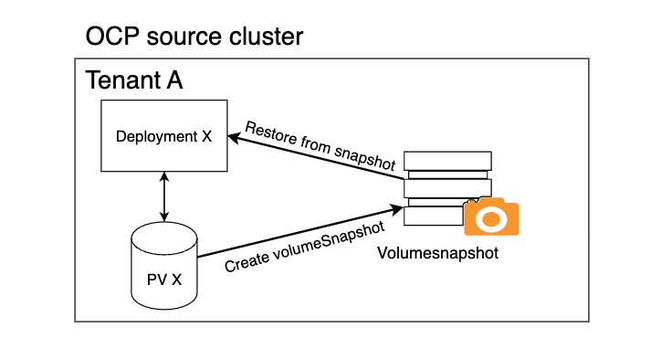
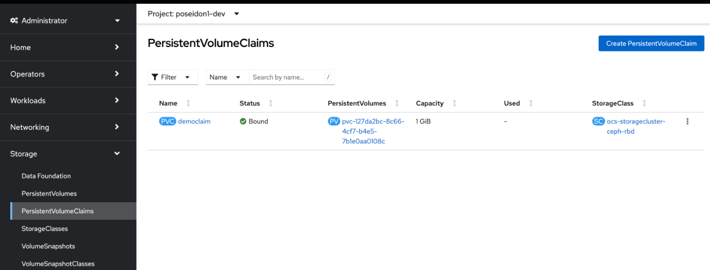
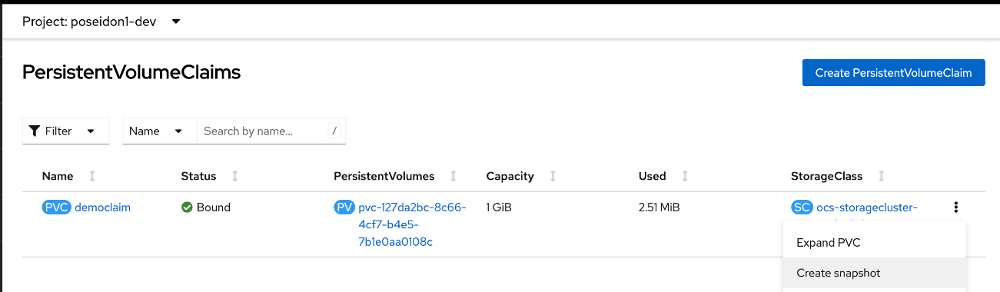
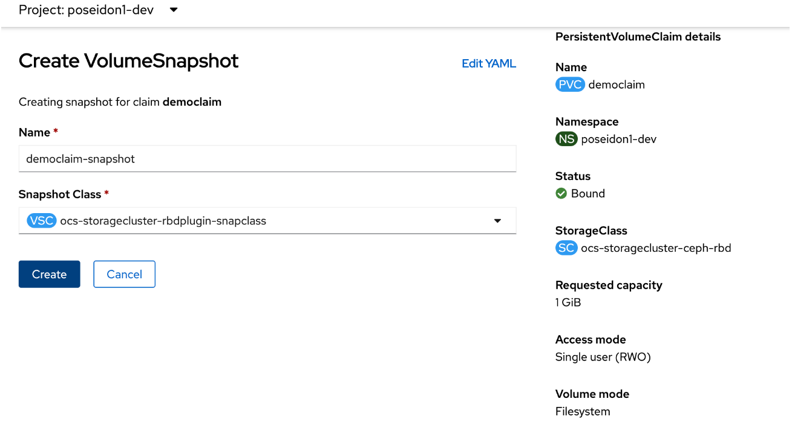
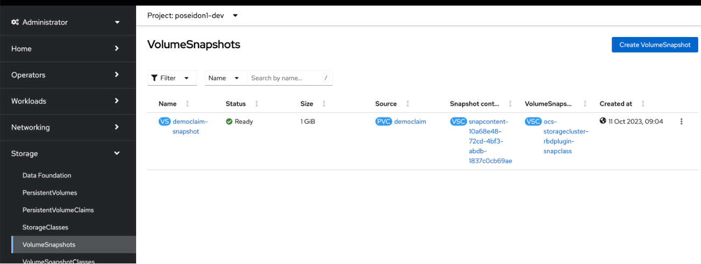
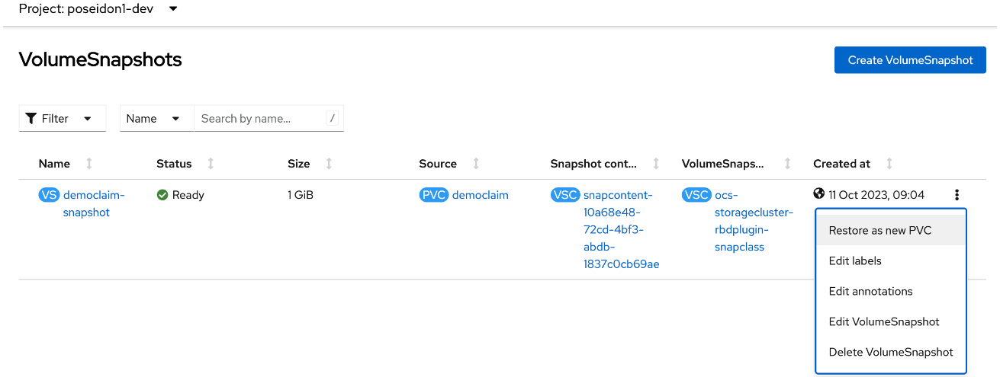
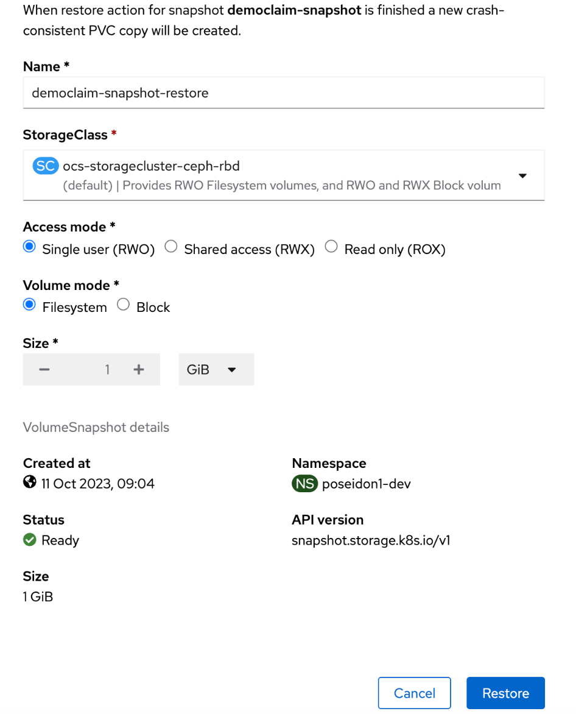
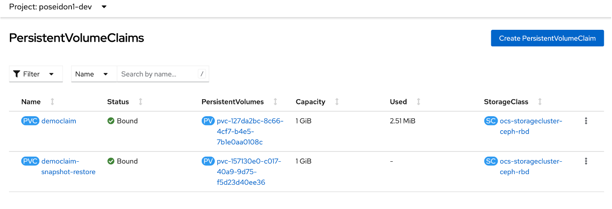

## Introduction
This user guide describes how backup using VolumeSnapshots are working in OpenShift. This process is controlled by the developers and they may backup and restore using this method as they wish. 

The diagram illustrates the process of managing persistent storage within an OpenShift Container Platform (OCP) cluster for Tenant A. A deployment (Deployment X) utilizes a persistent volume (PV X) to store its data. To ensure data protection, a snapshot of this volume is created, which captures the state of the data at a specific point in time. This snapshot can later be used to restore the deployment to its previous state if needed, providing a mechanism for data recovery and consistency. 

## Backup and restore persistent volumes

Container Platform as a Service allows developers to take point-in-time snapshots of persistent volume claims and restore the snapshots to a new persistent volume claim.

1. Navigate to Storage -> PersistentVolumeClaims in the OpenShift console.

2. Click the three dots to the right of the pvc you want to snapshot.

3. Proceed with default settings, and click "Create"

4. Navigate to Storage -> VolumeSnapshots to find your recently created snapshot.

5. To restore a PVC from the snapshot click the three dots next to the right of the VolumeSnapshot.

6. Proceed with default settings to create a new pvc.

7. Find your restored snapshot under Storage -> PersistentVolumeClaims.

