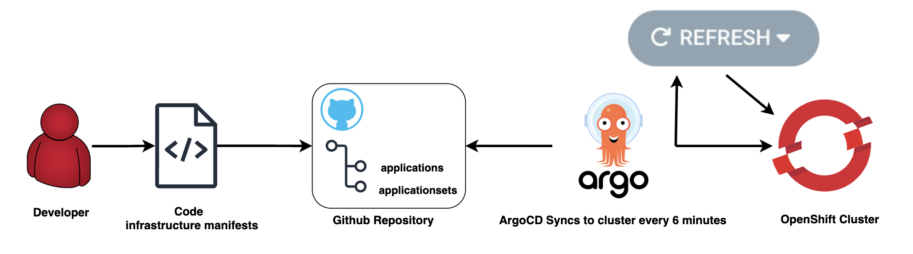

# Introduction to GitOps
This page introduces how to use OpenShift GitOps with Argo CD to manage and deploy Kubernetes resources from Git. 

**Official Documentation:** 

- [OpenShift GitOps](https://docs.openshift.com/container-platform/latest/cicd/gitops/understanding-openshift-gitops.html)
- [ArgoCD](https://argo-cd.readthedocs.io/en/stable/)

## Benefits of GitOps

GitOps uses Git repositories as the single source of truth. ArgoCD ensures cluster state matches repository definitions.

Key benefits:

- **Faster releases:** Automated deployments
- **Improved reliability:** Consistent environments, reduced drift
- **Enhanced security:** Auditable, compliant deployments
  
## ArgoCD Workflow

The ArgoCD Workflow is explain below in simple steps:

1. Make changes to the code in the repository connected to ArgoCD.
    - The ArgoCD ApplicationSets will automatically sync resources from the source repository.

2. By default, the Application Controller will sync your changes 6 minutes after they are pushed. If you'd prefer not to wait, follow these steps:
    1. Open your ArgoCD GitOps Developer URL and locate the application where you've made the code changes.
    2. In the application view, click `REFRESH`. A standard refresh checks if there have been changes in your source repository, such as a new commit or a new version of a Helm chart in the registry.
    3. If no updates appear, try clicking `HARD REFRESH`. This action invalidates the application's manifest cache, forcing the manifests to be re-rendered regardless of changes in the source.
    4. If the issue persists, click `SYNC`. This will reconcile the current cluster state with the desired state as defined in Git.

3. Wait for the synchronization process to complete.

## GitOps Workflow with OpenShift Tenants
To setup GitOps for you OpenShift Tenant follow the [Getting Started guide](gitops-setup.md#getting-started). Below is a short summary of the steps to push changes to OpenShift cluster:

1. Define tenant with desired GitOps method → submit to OCP Admin ([Tenant Quick Start](..//../../Quick%20Start/tenants-quick-start.md))
2. Choose `user-defined` and/or `auto-defined` application creation methods ([GitOps Setup](gitops-setup.md#gitops-methods))
3. Define Kubernetes resources in tenant's main Git repository ([Getting Started](gitops-setup.md#getting-started))
4. ArgoCD syncs resources from repository to cluster

## Best Practices
For additional info see [GitOps Best Practices](gitops-best-practices.md) for ArgoCD implementation guidelines and more information.