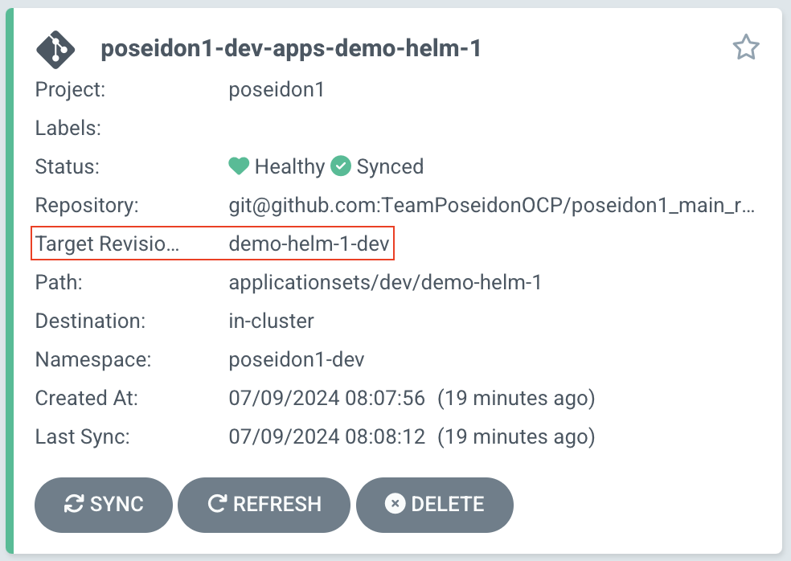
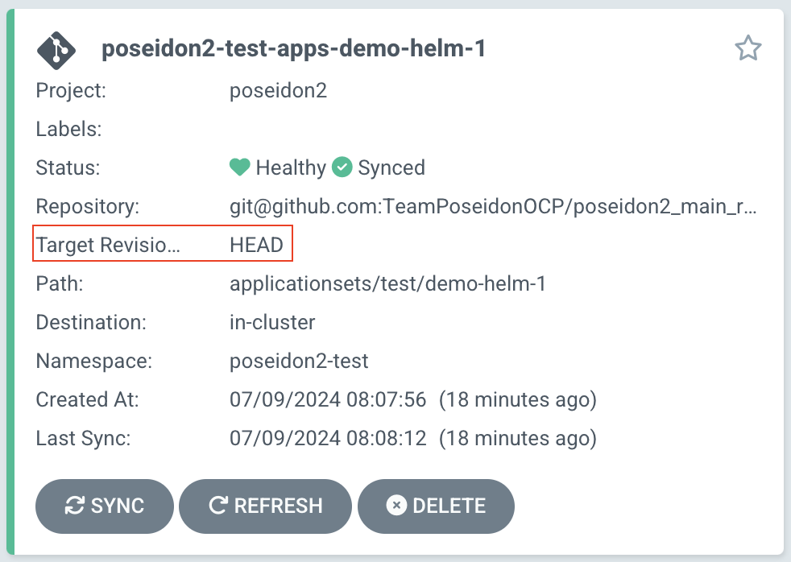

# Custom Auto-Defined TargetRevision

## Introduction
This solution allows setting the `targetRevision` at the application level for different environments in OpenShift. The generator picks up component names and creates  `targetRevision` values based on the application folder name instead of using `HEAD`. This enables more controlled and predictable versioning of applications in different environments.

## Pre-requisites
To use this solution, the following parameters must be set:

- `argocd.enable_auto_defined_apps`: Must be set to `true` to enable the use of `applicationsets` for deployments.
```yaml
argocd:
  enable_auto_defined_apps: true
```

## Configuration
When `environments[].custom_auto_defined_targetRevision` is set to `true`, the applicationset (auto-defined applications) will not use `targetRevision` equal to `HEAD`, but instead to the application folder name.

### Example of targetRevision values

- **test**: `<FOLDER_NAME>-test`
    - Example: `app-one-name-test`

- **dev**: `<FOLDER_NAME>-dev`
    - Example: `app-two-name-dev`

- **prod**: `HEAD`
    - In accordance with good GitOps practices, `main` should initially be `prod`. Therefore, we will use `HEAD` (latest commit in `main`) for `prod`.

### Tenant Configuration
An example configuration of a tenant might look like this:

```yaml
...
environments:
  - name: test
    custom_auto_defined_targetRevision: true
  - name: dev
    custom_auto_defined_targetRevision: false
argocd:
  enable_user_defined_apps: false
  enable_auto_defined_apps: true
...
```
<br>
Read more about this feature in the Environment section here:

- [How to configure an Environment](../../../OpenShift%20Tenants/Tenant%20features/environments.md)

### ArgoCD
The changes will also be visible in ArgoCD as the application cards now have an update targetRevision which shows either the `<folder-name>-<environment>` or `HEAD`.


<div class="grid cards" markdown>

<figure markdown="span">
  { width="400" }
  <figcaption><i>custom_auto_defined_targetRevision: true</i></figcaption>
</figure>

<figure markdown="span">
  { width="400" }
  <figcaption><i>custom_auto_defined_targetRevision: false</i></figcaption>
</figure>

</div>


## Summary
This solution ensures that applications can have distinct versions for different environments by using application folder names as the `targetRevision`. This provides better control over which versions run in `test` and `prod` environments.