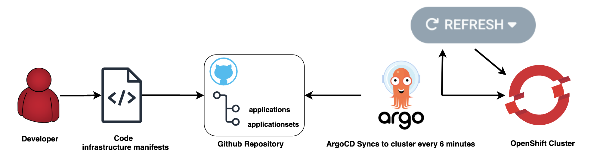
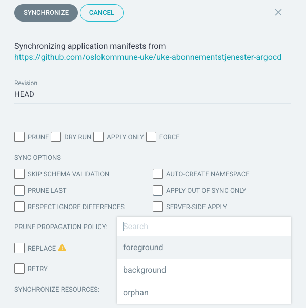

# OpenShift GitOps Best Practices

This page provides best practices for configuring Argo CD and optimizing GitOps workflows, including guidance on sync options and their recommended usage.

**Official Documentation:** [ArgoCD Documentation](https://argo-cd.readthedocs.io/)

## Configuration

!!! info
    The ArgoCD Application Controller is configured to auto-sync every **6 minutes**. 
    
    This interval is set to reduce CPU load, thereby improving the overall performance of the Application Controller.

For detailed instructions on configuring ArgoCD for your tenant, refer to:

- [How to Configure Argo CD](../../../OpenShift%20Tenants/Tenant%20features/GitOps/gitops-introduction.md)

## ArgoCD Workflow

The ArgoCD Workflow is explain below in simple steps:

1. Make changes to the code in the repository connected to ArgoCD.
    - The ArgoCD ApplicationSets will automatically sync resources from the source repository.

2. By default, the Application Controller will sync your changes 6 minutes after they are pushed. If you'd prefer not to wait, follow these steps:
    1. Open your ArgoCD GitOps Developer URL and locate the application where you've made the code changes.
    2. In the application view, click `REFRESH`. A standard refresh checks if there have been changes in your source repository, such as a new commit or a new version of a Helm chart in the registry.
    3. If no updates appear, try clicking `HARD REFRESH`. This action invalidates the application's manifest cache, forcing the manifests to be re-rendered regardless of changes in the source.
    4. If the issue persists, click `SYNC`. This will reconcile the current cluster state with the desired state as defined in Git.

3. Wait for the synchronization process to complete.

## Options in ArgoCD

ArgoCD provides several options for managing applications, making it easier to monitor and maintain the resources in your cluster. Below is an overview of the key options:

### Refresh Options In ArgoCD

#### Refresh
   The `Refresh` option is used to update the application state from Git. This is useful for checking if there have been any changes without necessarily triggering a full sync.

   - **Refresh**: Updates the application state based on changes in Git or Helm sources. It checks for updates but does not force a full cache refresh.

   - **Hard Refresh**: Invalidates the cache and forces a full update of the application's state by re-reading all resources from Git or Helm. This is useful if you suspect discrepancies between the cache and the actual state.

### Sync Options in ArgoCD

These options will be explained in the section below.

#### General Sync Options

1. **PRUNE**  
   When selected, ArgoCD will remove any resources in the cluster that are no longer present in the Git repository. This ensures that obsolete resources are cleaned up during synchronization.

2. **DRY RUN**  
   This option allows you to simulate a sync without actually applying any changes. It shows you what changes would be made if you were to perform a full sync, but doesn't alter the live environment.

3. **APPLY ONLY**  
   When checked, only the resources that are defined in the Git repository are updated or applied, but resources that are no longer in the Git repository will not be pruned or deleted.

4. **FORCE**  
   This option forces the sync operation by overriding any validation checks or conflicts. It is useful when you need to apply changes even if there are conflicts with the current state of resources in the cluster.

#### Additional Sync Options

1. **SKIP SCHEMA VALIDATION**  
   Skips the validation of the resource's schema before applying changes. This can be useful if you are deploying custom resources or using configurations that might not adhere strictly to schema validation.

2. **AUTO-CREATE NAMESPACE**  
   When selected, ArgoCD will automatically create the target namespace if it doesn't already exist. This is useful when deploying applications to a fresh cluster or a namespace that hasn't been set up yet.

3. **PRUNE LAST**  
   This ensures that resource pruning (deleting obsolete resources) happens as the final step of the sync process. It ensures that existing resources are updated or replaced before any removals occur.

4. **APPLY OUT OF SYNC ONLY**  
   When this is checked, only resources that are currently out of sync (i.e., that differ from the desired state in Git) are updated. Resources that are already in sync will be left untouched.

5. **RESPECT IGNORE DIFFERENCES**  
   This option respects any specific fields or resources that have been marked to "ignore differences." These differences might be those defined in an override or annotation to avoid syncing certain parts of the manifest.

6. **SERVER-SIDE APPLY**  
   This syncs the resources using Kubernetes' server-side apply, which enables declarative updates to resources by merging the desired state with the server’s current state.

#### Prune Propagation Policy

- **foreground**  
   This specifies the deletion policy when pruning resources. "Foreground" ensures that resources are deleted in a way that respects dependencies, i.e., ArgoCD will wait for dependent resources to be fully deleted before removing the resource itself.

- **background**  
   In the background mode, ArgoCD will delete the resource immediately and allow Kubernetes to handle the deletion of any dependent resources in the background. This can be quicker, but it may leave some orphaned resources if dependencies aren't managed correctly.

- **orphan**  
   The orphan option allows ArgoCD to delete resources without waiting for their dependents or ensuring that dependents are handled. This option should be used with caution, as it can leave behind resources that were dependent on the deleted resource, potentially causing inconsistencies in the cluster.

#### Other Options

1. **REPLACE**  
   This forces the replacement of all resources instead of just updating them. It deletes and recreates the resources, which may result in downtime but ensures a full reset of the state.

2. **RETRY**  
   Automatically retries the sync operation in case of failures, potentially with backoff logic to space out retries.

