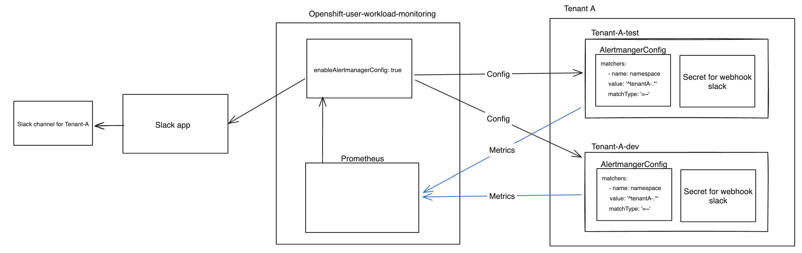
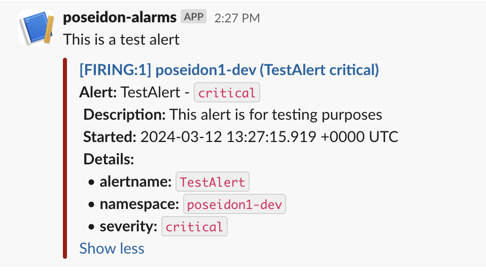
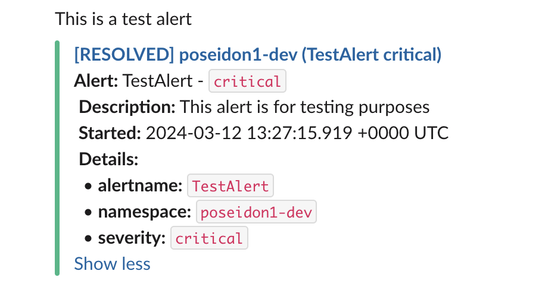

# Slack Alert Integration with OpenShift Alerts

This user guide describes how to set up a Slack integration for OpenShift alerts and it also provides a design overview of the process. Follow the steps below to set up a Slack app and how to configure your tenant order to start receiving alerts to your desired Slack channel. 

## Design overview
### alertmanagerConfig for Slack

This diagram represents a monitoring setup for an OpenShift environment using Prometheus and Slack for notifications.



## Prerequisites

- You must have a Slack channel ready for receiving alerts.


## Creating a Slack Webhook via a Slack App

To send alerts to a Slack channel, you first need to create a Slack app and configure a webhook. Follow these steps:

### 1. Create a New Slack App:
   - Go to the [Slack API](https://api.slack.com/apps) page and click on "Create New App".
   - Choose "From scratch", enter your App Name, and select the Slack Workspace where the app will be installed.
### 2. Activate Incoming Webhooks:
   - In the "Features" section on the sidebar, click on "Incoming Webhooks".
   - Toggle the switch to activate incoming webhooks.
### 3. Create a Webhook URL for Your Slack Channel:
   - Click on "Add New Webhook to Workspace".
   - Choose the channel where you want to receive alerts and click "Allow".
   - Slack will generate a Webhook URL; this URL will be used in your alerting configuration.
### 4. Secure Your Webhook URL:
   - You then have to encrypt your Webhook URL using SealedSecrets for Kubernetes. Follow the instructions provided below.

## Encrypt secret with kubeseal

### 1. Base64 encode webhook
* The webhook-URL you have generated from your Slack app needs to be stored in a secret, which you apply to your desired namespace. The first step is to base64 encode the webhook URL:

```bash
echo -n <webhook-url> | base64
```

### 2. Encrypt the Secret with Kubeseal
* Paste the encoded URL in the secret and change the name of the secret. This secret name is not important as we only need the encrypted url.

=== "secret.yml"
    ```yaml
    apiVersion: v1
    kind: Secret
    metadata:
      name: <secret name> # not important as you only need the encrypted url
    type: Opaque
    data:
      url: <base64 encoded webhook>
    ```
=== "Demo"
    ```yaml
    apiVersion: v1
    kind: Secret
    metadata:
      name: webhook-secret
    type: Opaque
    data:
      url: d3d3Lm15c2VjcmV0d2ViaG9vay5jb20K
    ```

To seal the secret with `kubeseal`, you can use the following command:

```bash
kubeseal --cert /path/to/pub.cert --scope cluster-wide -f secret.yaml -o yaml > sealed_secret.yaml
```

Replace `/path/to/pub.cert` with the path to your public certificate. `secret.yaml` is the path to the Secret YAML file you created in the first step. The sealed secret will be outputted to `sealed_secret.yaml`.

**Read more about encrypting a secret with kubeseal from this** [guide](../../Secret%20Management/Sealed%20Secrets/encrypting-secret-with-sealed-secrets.md)

## Helm Chart Configuration for Slack Alerts

After setting up your Slack webhook, you need to configure your Helm chart to use this webhook for alerting.

### Configuration Parameters

| Parameter                                                     | Description                                                                                                                                |
| ------------------------------------------------------------- | ------------------------------------------------------------------------------------------------------------------------------------------ |
| `slack_alert_integration.enable`                              | Set to `True` to enable Slack alert integration.                                                                                           |
| `slack_alert_integration.alert_severity`                      | Define the severity of alerts to be sent (e.g., `critical`, `warning`, `info`). For multiple severities, separate them with a pipe (`\|`). |
| `slack_alert_integration.webhook_secret.encrypted_webhookURL` | Encrypted Slack webhook URL.                                                                                                               |

### 1. Update your tenant definition, e.g `values.yml`: 
Define your Slack alerting configurations in for your Helm chart.

=== "values.yml"
    ```yaml
    slack_alert_integration:
      enable: true
      alert_severity: critical  # Can be one or multiple from: critical|warning|info
      webhook_secret:
        encrypted_webhookURL: "<your-encrypted-webhook-url>"
    ```

=== "Demo"
    ```yaml
    slack_alert_integration:
      enable: true
      alert_severity: critical|warning|info
      webhook_secret:
        encrypted_webhookURL: Mohlnf5T512UsdGSDG$W$F#VE6WLDzYo8hTe/ssPKlbZFUypY1rD74NpTN0Arrw4lP48Wxwln7RkPbkhMONFI5lHuzxSuu7iaN8CeUYaxMD6o1V+xX2Rgy56AjNvhevSqrdBU40qU8TRS4LfH/VZ4ueq4kDzhCjh4POXLpCwwG4tod420COFtQY6vxe8VdbDxUbxoP8b3/Q+vJAd5XOVOKZS7/DFGfi10w4vJfKuQ3OX/y2moFpopN8iTYxCoI9a9/wjKq2kA7D0Y9ySUW
    ```


### 2. Deploy Your Helm Chart:
With the `values.yml` configured, deploy your Helm chart to apply the Slack alert integration settings. The Helm chart will use the configurations from `values.yml` to set up `AlertmanagerConfig` and `SealedSecret` resources as necessary.


## Example test alert

Change the needed variables and apply the prometheus rule in your environment to send a alert to Slack. 

!!! Note
    Edit the `metadata.namespace` and `spec.groups.rules.labels.namespace` to a namespace in your cluster

```yaml title="test-alert.yml" hl_lines="10 19"
apiVersion: monitoring.coreos.com/v1
kind: PrometheusRule
metadata:
  labels:
    app.kubernetes.io/name: custom-monitoring-rules
    app.kubernetes.io/part-of: openshift-monitoring
    prometheus: k8s
    role: alert-rules
  name: test-alarm
  namespace: <NAMESPACE>
spec:
  groups:
  - name: Test for sending an immediate alarm
    rules:
    - alert: TestAlert
      expr: vector(1) > 0 
      labels:
        severity: critical
        namespace: <NAMESPACE>
      annotations:
        summary: "This is a test alert"
        description: "This alert is for testing purposes"
```


<div class="grid" markdown>

**Alert is firing**
{ .card }

**Alert is resolved**
{ .card }

</div>