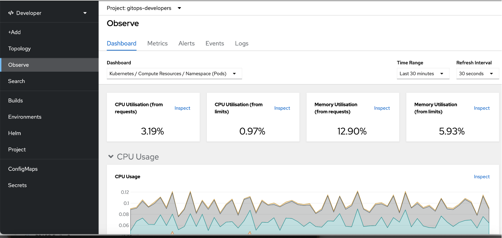

---
Author: SolidCloud
Title: Using OpenShift Observability
Version: 1.0.0
externally-exposed: true
--- 
<!-- TODO REMOVE?? does this give any value? if yes add it to another page -->
# Using OpenShift Observability

## Prerequisites

* An OpenShift tenant created by Sopra Steria

## Introduction

In the OpenShift console, developers can access an observability hub for their applications. This hub gives real-time access to performance dashboards, triggered alerts and system logs in a user-friendly format.

## Accessing the observability hub

### Steps

1. Navigate to the openshift-console.
2. Select "Developer View", and navigate to "Observe"
3. You should see performance metrics from your application, as seen below.

