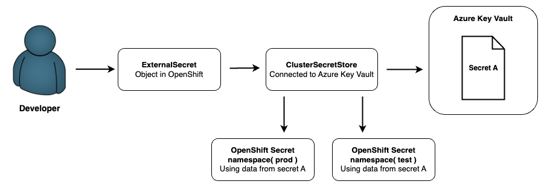
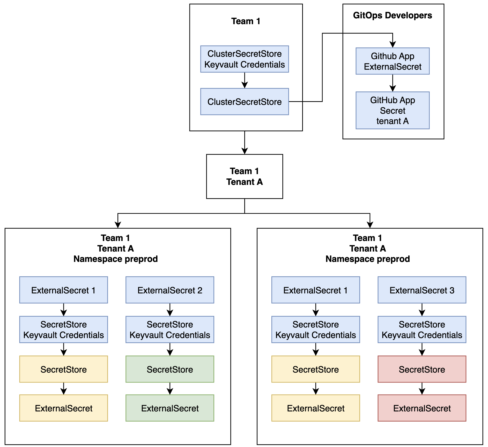

---
Author: Oskar Marthinussen, Marcus Notø
Title: Configuring External Secrets
Version: 1.0.0
externally-exposed: true
--- 

# External Secrets Introduction

This page explains how to use External Secrets in OpenShift to securely sync secrets from Azure Key Vault and other providers into your cluster.
It covers how to configure SecretStore and ClusterSecretStore resources for scalable and secure secret management across teams and tenants.

**Official Documentation:** [External Secrets Operator](https://external-secrets.io/latest/)

Below is a diagram to illustrate how the external secrets and cluster secret store works:

## Cluster Secret Store with team integration

With team integration, a `ClusterSecretStore` can be created at the team level and made accessible to all tenants managed by that team. This setup allows the team to centrally manage the credentials used by individual `SecretStore` resources across multiple tenant namespaces.

As illustrated below, the blue boxes represent secrets and credentials associated with the `ClusterSecretStore`.

!!! Info
    `ExternalSecret 1–3` are defined in each tenant's namespace and reference the shared `ClusterSecretStore` to retrieve credentials from Azure Key Vault. 

This model ensures a consistent and scalable approach to secret management across environments while reducing duplication and simplifying credential lifecycle management.

## External Secrets Resource

In OpenShift, External Secrets allow applications to use secrets stored in external systems without exposing sensitive data in cluster configuration. They address several limitations of native OpenShift Secrets:

* **Secure Storage:** Secrets remain stored securely in an external backend. Gaining access requires compromising both the OpenShift cluster and the external provider, making it Git-friendly and more secure.
* **Automated Rotation:** Many supported providers offer automatic secret rotation, reducing the need for manual updates and improving security posture.

## How it works
1. A `SecretStore` resource defines the connection to external KMS (e.g., Azure Key Vault)
2. Developer creates an `ExternalSecret` resource referencing the `SecretStore`
3. ExternalSecret fetches secrets and creates Kubernetes Secret objects
4. Resources can be stored in Git for GitOps workflows

!!! info
    You can choose between creating a <ins>SecretStore</ins> or a <ins>ClusterSecretStore</ins>:

    * **ClusterSecretStore**: Available cluster-wide across multiple namespaces
    * **SecretStore**: Scoped to a single namespace

This documentation focuses on Azure Key Vault, but External Secrets supports many providers. See the [official documentation](https://external-secrets.io/latest/) for more details.

## Configure secret store with Azure Key Vault for your tenant

For configuring a secret store with Azure Key Vault you have to do the following:

- [**SecretStore Configuration**](configuration-secretstore.md) - Setup App Registartion and Azure Key Vault and give the App Registration the 'Key Vault Secrets User' role

## Creating external secrets with Azure Key Vault

- [**External Secret Creation**](creating-external-secrets.md) - Add the App Registration credentials and Azure Key Vault url to the OpenShift Tenant (or Team Overlay) and create your external secret