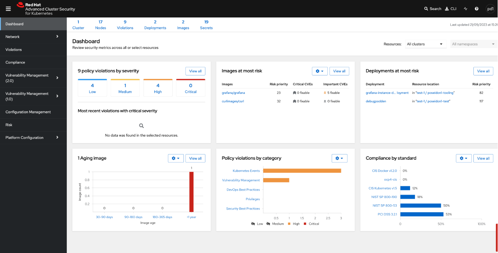

# OpenShift Advanced Cluster Security (ACS)

## Introduction

[OpenShift Advanced Cluster Security (ACS)](https://www.redhat.com/en/technologies/cloud-computing/openshift/advanced-cluster-security-kubernetes) is an essential add-on for Container Platform as a Service (CaaS), purpose-built to enhance the security of your cloud-native applications. This guide is designed to help developers and DevOps professionals effectively use ACS to secure their deployments.

### Purpose and Benefits
This guide is intended for developers and DevOps professionals responsible for building, deploying, and running cloud-native applications on OpenShift. ACS gives a range of benefits, including:

- **Enhanced Security and productivity**: ACS actively identifies and mitigates security threats throughout the development lifecycle. ACS provides integrated security guardrails that support developer velocity, allowing them to focus on innovation while maintaining a high level of security.

- **Policy Enforcement**: ACS enforces security policies seamlessly, ensuring developers adhere to best practices and compliance standards without disrupting their workflow.

- **Continuous Scanning**: Developers benefit from continuous scanning of container images and workloads, addressing vulnerabilities early in the development process.

- **CI/CD Integration**: ACS integrates smoothly into CI/CD pipelines, automating security checks and preventing vulnerabilities from reaching production environments.

- **Reduced Operational Risk**: By leveraging Kubernetes-native controls and automation, developers can minimize operational risk, reducing potential impacts on applications and infrastructure.

## Getting Started with ACS

### Prerequisites

The following steps must be done before you can use ACS to enhance the security of your organisation's applications:

* Order the ACS add-on for your OCP from Sopra Steria:
   * Before using ACS, the product has to be enabled for your OpenShift Container Platform (OCP). ACS will run as an operator on the cluster and has to be enabled by OpenShift Administrators.
* Order access for your specific Tenant to ACS:
   * Access must be ordered from Sopra Steria for each tenant.

### ACS Dashboard Overview

The ACS dashboard gives a quick overview of the security standards of your namespace. You can see policy violations by severity and by category. Which images and deployments are at most risk and compliance by different compliance standards.

### Checking vulnerable deployments

Steps:

1. Navigate to Vulnerability Management (1.0) --> Dashboard.
2. In the Top riskiest images section you will find all your images sorted from most vulnerable to least vulnerable. 
3. Click an image to get an in-dept analysis of the security of a given image, including CVE's, the containerfile and an analysis of vulnerabilities by image component. 

