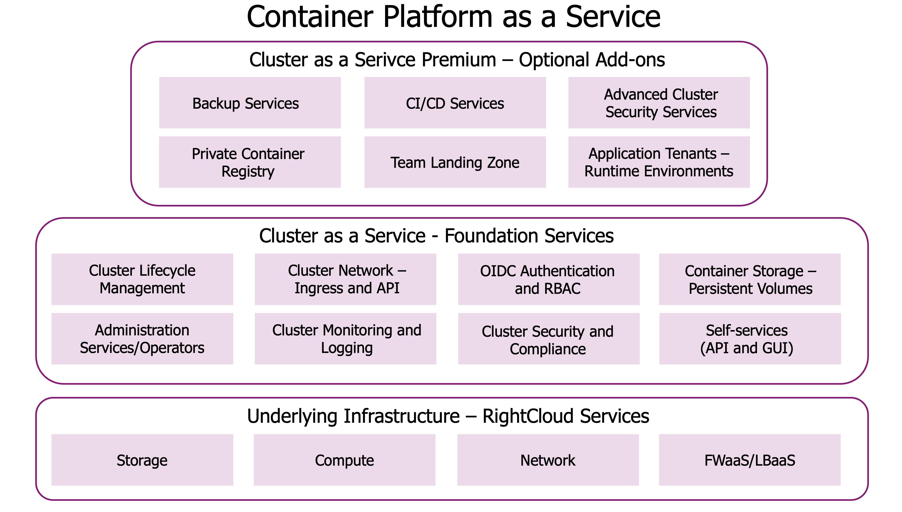

# Service Breakdown: Container Platform as a Service

Sopra Steria’s Container Platform as a Service (CPaaS) is a managed Kubernetes/OpenShift offering that enables customers to build, run, and scale containerized applications securely and efficiently — whether in the cloud or on-premises.

CPaaS is delivered through a layered service model and can be tailored to meet different needs for compliance, control, and developer enablement.

## What the Platform Consists Of

The diagram below illustrates how the service is composed:

The service is built in **three layers**, which can be tailored to match each customer’s specific requirements.

### 1. **Infrastructure Layer**
- Delivered from **Sopra Steria’s SolidCloud**, p**ublic cloud (Azure, AWS, GCP)**, or a **sovereign cloud setup** in Sopra Steria’s data center, optionally extended or isolated to the customer’s own data center
- Provides core services such as compute, storage, networking, and security

### 2. **Foundation Services** (included in all clusters)
- Cluster lifecycle management (deployments, patching, upgrades)
- Networking (API exposure and ingress)
- Authentication and RBAC (OIDC integration)
- Persistent storage
- Monitoring, logging, and basic compliance tooling
- Self-service access (GUI and API)
- Administration of core Kubernetes/OpenShift services

### 3. **Optional Developer Services**
These add-ons provide full developer environments and operational support:
- GitOps and CI/CD pipelines
- Secret management and RBAC policies
- Backup and restore
- Application runtime environments (Tenants)
- Private container registry
- Advanced security policies and observability

## Service Variants

Based on your organization’s needs, you choose one or more of the following **service variants**:

### **Dedicated Container Platform**
A fully isolated platform environment designed for customers with **strict security**, **compliance**, or **data residency** requirements.

- Runs on **dedicated infrastructure**, operated by Sopra Steria or hosted on-premises
- Ideal for **sovereign cloud** or **regulated environments**
- After setup, you can purchase one or more **dedicated clusters** from Sopra Steria (CaaS or Premium)
- Optional developer services can be added per cluster

---

###  **Cluster as a Service (CaaS)**
A **dedicated OpenShift cluster** delivered with the full foundation service layer.

- Hosted on Sopra Steria SolidCloud or public cloud
- Ideal for teams with **existing DevOps capability**
- You manage your own pipelines, RBAC, tenants, and GitOps setup
- Developer services are not included by default

---

### 🚀 **Cluster as a Service Premium**
A **dedicated OpenShift cluster** delivered with built-in developer environments.

- Includes GitOps, RBAC, observability, secrets management, and runtime environments
- Ideal for teams who want **Sopra Steria to manage platform enablement**
- Delivered on SolidCloud or public cloud

---
##  How It Fits Together

All customers receive **dedicated OpenShift clusters**. The main differences between the service variants lie in:

- The level of **infrastructure and operational isolation**
- The scope of **developer enablement and automation** included

| Platform Layer               | Dedicated Container Platform         | Cluster as a Service             | Cluster as a Service Premium     |
|-----------------------------|--------------------------------------|----------------------------------|----------------------------------|
| **Cluster infrastructure**  | ✅ Dedicated physical (customer-specific) | ✅ Cluster runs on shared infrastructure platform (workload isolated per customer) | ✅ Same as CaaS (isolated per customer) |
| **Control & management stack** | ✅ Fully isolated management tooling and access control (per platform) | 🔄 Operated via Sopra Steria’s shared control plane | 🔄 Same as CaaS |
| **Foundation services**     | 🔁 Optional per cluster              | ✅ Included                      | ✅ Included (This is the service)                     |
| **Developer services**      | 🔁 Optional per cluster              | ❌ Not included. each add-on is optional               | ✅ Included                      |

> ✅ = Included or dedicated  
> 🔄 = Logically separated, but managed through a shared Sopra Steria operational platform  
> 🔁 = Available optionally per cluster  
> ❌ = Not included

## Which Setup Is Right for You?

Choosing the right setup depends on your organization’s compliance needs, internal platform maturity, and how much of the operational responsibility you want to take on.

| If you are...                                                                                   | Recommended Setup                              |
|--------------------------------------------------------------------------------------------------|------------------------------------------------|
| A public sector or regulated organization requiring strict control, data residency, or isolation | **Dedicated Container Platform** + one or more managed clusters |
| A customer with a strong, internal **platform team** that understands OpenShift/Kubernetes, and has a mature **DevOps culture** | **Cluster as a Service**                        |
| A team with limited DevOps capacity that needs Sopra Steria to handle the platform setup, pipelines, tenants, and security guardrails | **Cluster as a Service Premium**                |
