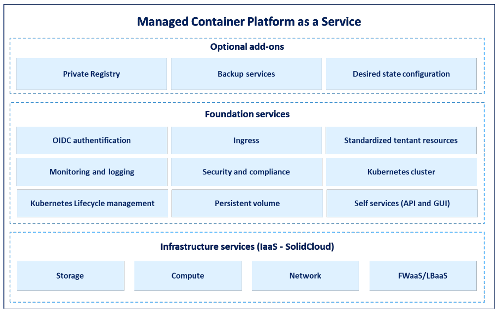

## Introduction

Sopra Sterias "Container Platform as a service" enables customers to establish, organize, run and scale containerized applications in a production-ready environment. The service is based on Red Hat OpenShift. Developers are allowed to focus on building and running applications and services, as the kubernetes complexity is reduced. Key benefits are:

* Faster development of new services, as new projects are equipped with a standard set of resources and workflows. The workflows allow developers to build secure and scaleable applications from day 1.
* Continous deployment of new features, as developers have full control over their release cycle. Developers are allowed to publish applications internaly or directly to the internet, depending on the customer policies. 
* Streamlined development process as the service includes tooling for continous deployment, vulnerability scanning and pre-defined framework conditions for applications.
* Compliance with regulatory demands that require that data are stored in a national cloud. The service can also be delivered on hyperscalers such as Google Cloud Platform, Microsoft Azure or Amazon Web Services.
* Backed by a team of Kubernetes experts that continously developes the service based on customer requirements and requests.

## Service breakdown

Container Platform as a Service delivers an all-encompassing platform for containerized application environments, utilizing OpenShift as its foundation. It encompasses a suite of features including resource orchestration, stringent access controls, comprehensive logging, robust security measures, dedicated container storage solutions, and ongoing maintenance of both the platform and its underlying infrastructure. Additionally, it offers performance analytics and supports agile methodologies. This service is designed to streamline development workflows, enabling continuous integration and delivery, all while integrating GitOps practices for operational efficiency.

## OpenShift tenants

To facilitate granular access control and efficient distribution of platform resources among different development teams, the Provider has built a tenant concept. Each tenant is a set of resources that a team can choose to use.

New resources are continuously added as needed. In the tenant concept, development teams are given access to a set of OpenShift namespaces, with a combined resource limit for memory and CPU capacity. Developers can manage these resources themselves as needed through standardized roles linked to the customer’s Azure AD/Entra ID.

Other components that development teams have access to through the tenant concept include:

* The ability to define when backups should be taken of the resources in the tenant: Which resources are backed up, and how long backups should be retained.

* Rules for incoming and outgoing traffic. Which services should be able to reach the applications running in the tenant and which services it should be possible to reach from the tenant are defined in the form of a list of URLs and IP sets.

* Application secrets can be stored in Azure Keyvault and dynamically retrieved as needed. If the project is prevented from using Azure Keyvault, Bitnami sealed secrets can be used for handling secrets in a version-controlled format.

* A dedicated Grafana instance can be set up and used to build custom Grafana dashboards.

* Git repositories can be used to define the resources to be built in the tenant, to ensure version control of everything that is built in the tenant.

To read more about the tenant concept, refer to [this article](../OpenShift Tenants/Introduction-to-openshift-tenants.md).

## Managing tenant configuration

Tenants are defined in the customers git. Changes in tenant configuration are submitted through pull requests. Once a pull request is approved, the changes are immediately synced to the environment through a GitOps process. This solution for ordering and configuring tenants ensures that both the Service Provider and the customer have insight into the current tenant configuration at any given time.

## Developing Container Platform as a Service

The Container Platform as a Service offering is subject to continous development based on user input. A customer champion attends regular meeting with customer platform engineers to ensure that the service fits customer needs and that feature requests are properly prioritized. Feature requests from customers are gathered in a common backlog, and new features are made available across all customers. 

