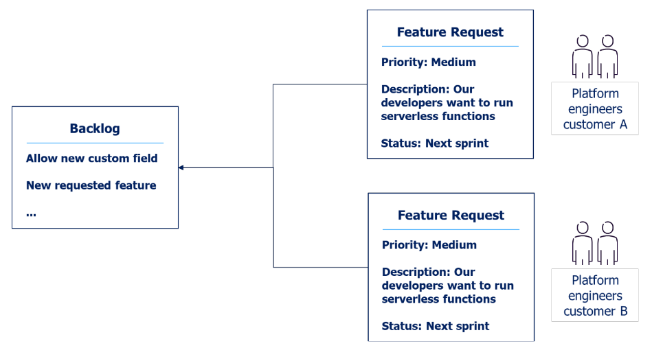

# Developing Container Platform as a Service

The Container Platform as a Service offering is subject to continous development based on user input. A customer champion attends regular meeting with customer platform engineers to ensure that the service fits customer needs and that feature requests are properly prioritized. Feature requests from customers are gathered in a common backlog, and new features are made available across all customers. 

