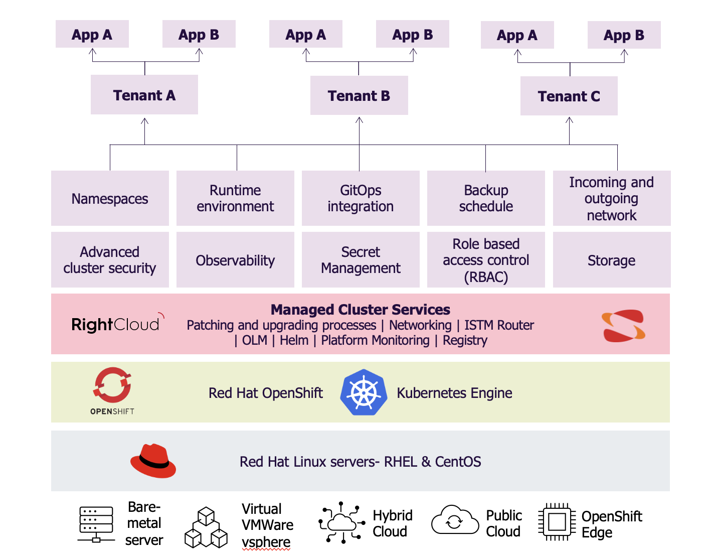

# Introduction
Sopra Steria’s Container Platform as a Service (CPaaS) is a managed Kubernetes solution that simplifies the deployment and operation of containerized applications. Built on Red Hat OpenShift, it provides a secure, production-ready environment tailored for both modern DevOps workflows and regulated enterprise use cases.

By abstracting away Kubernetes and infrastructure complexity, the platform allows developers to focus on delivering business value through applications and services—faster and more securely.

The figure below illustrates the architecture and key components of the offering:

## Key Benefits

* **Accelerated development** - Standardized resources and workflows enable secure, scalable application delivery from day one.
* **Developer autonomy** – Teams manage their own release pipelines and deployment strategies within defined guardrails.
* **Built-in DevSecOps** – Integrated tooling for GitOps, vulnerability scanning, and compliance enforcement.
* **Regulatory flexibility** – Supports deployment in public cloud, private cloud, and sovereign infrastructures.
* **Continuous evolution**  - A dedicated Kubernetes team continuously improves the platform in response to customer needs and based on product evolvement.

## Service Variants

To meet diverse needs across organizations, Sopra Steria delivers the platform through several service variants—each tailored to different levels of control, isolation, and built-in functionality:

| Service                     | Description |
|-----------------------------|-------------|
| **Dedicated Container Platform** | A fully isolated, customer-specific container platform for hosting and managing multiple Kubernetes or OpenShift clusters. Ideal for sovereign cloud needs or regulated environments. |
| **Cluster as a Service**         | A minimal, standalone Kubernetes or OpenShift cluster managed by Sopra Steria. Includes core platform services like lifecycle management and patching. |
| **Cluster as a Service Premium** | A managed cluster delivered with ready-to-use developer environments (Tenants), including GitOps, RBAC, secret management, observability, and security policies. |

## Deployment Models

CPaaS is available on multiple infrastructure backends:

* **Public cloud:** AWS, Azure, GCP
* **Private cloud:** Sopra Steria’s SolidCloud
* **Sovereign cloud:** Dedicated, isolated infrastructure hosted in either Sopra Steria or customer data centers

## Service Levels & Support

* 99.95% uptime SLA, supported by fault‑tolerant OpenShift control and runtime nodes
* Monitoring via Prometheus/Grafana and a dedicated Remote Operations Centre
* 24x7 support aligned with ITIL/ISO20000 incident and change management processes

## Who Is It For?

Sopra Steria Container management services is ideal for:

* Enterprises adopting container platforms for modern applications
* Public sector organizations with compliance and sovereignty needs
* Teams seeking built-in DevSecOps and GitOps workflows without managing infrastructure

⸻

