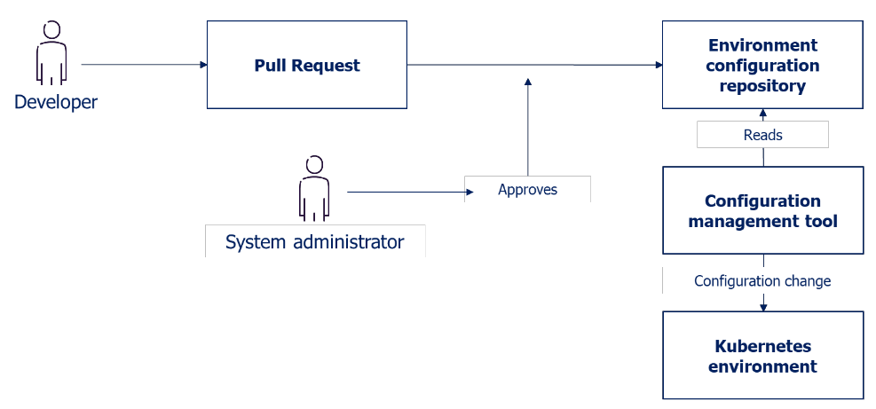

# Managing tenant configuration

Tenants are defined in the customers git. Changes in tenant configuration are submitted through pull requests. Once a pull request is approved, the changes are immediately synced to the environment through a GitOps process. This solution for ordering and configuring tenants ensures that both the Service Provider and the customer have insight into the current tenant configuration at any given time.

