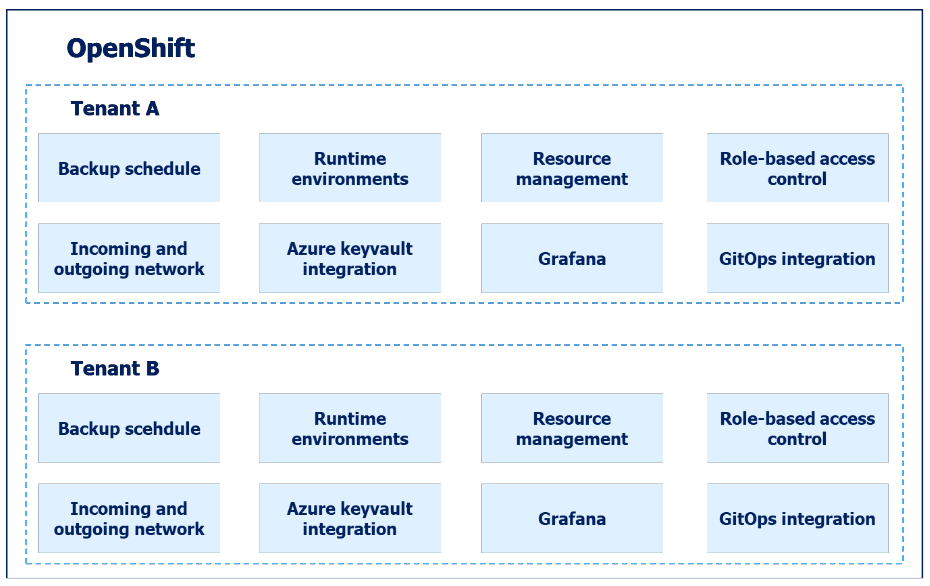

# OpenShift tenants

To facilitate granular access control and efficient distribution of platform resources among different development teams, the Provider has built a tenant concept. Each tenant is a set of resources that a team can choose to use.

New resources are continuously added as needed. In the tenant concept, development teams are given access to a set of OpenShift namespaces, with a combined resource limit for memory and CPU capacity. Developers can manage these resources themselves as needed through standardized roles linked to the customer’s Azure AD/Entra ID.

Other components that development teams have access to through the tenant concept include:

* The ability to define when backups should be taken of the resources in the tenant: Which resources are backed up, and how long backups should be retained.

* Rules for incoming and outgoing traffic. Which services should be able to reach the applications running in the tenant and which services it should be possible to reach from the tenant are defined in the form of a list of URLs and IP sets.

* Application secrets can be stored in Azure Keyvault and dynamically retrieved as needed. If the project is prevented from using Azure Keyvault, Bitnami sealed secrets can be used for handling secrets in a version-controlled format.

* A dedicated Grafana instance can be set up and used to build custom Grafana dashboards.

* Git repositories can be used to define the resources to be built in the tenant, to ensure version control of everything that is built in the tenant.

* **Simplified Multi-Tenancy:** Provides streamlined multi-tenancy within OpenShift.
* **Access Control:** Simplifies RBAC configuration with a "least privilege" mindset, automatically maintaining up-to-date rules with zero manual effort.
* **Self-Service:** Enables users to safely provision Kubernetes resources and objects for themselves and their teams. Team-owned namespaces and their resources count towards team quotas, simplifying resource allocation and sharing.
* **ArgoCD Integration:** Integrates with ArgoCD for streamlined RBAC management.
* **Cost and Resource Optimization:** Defines resource quotas at the tenant scope for efficient resource allocation.

To read more about the tenant concept, refer to [this article](../OpenShift Tenants/Introduction-to-openshift-tenants.md).