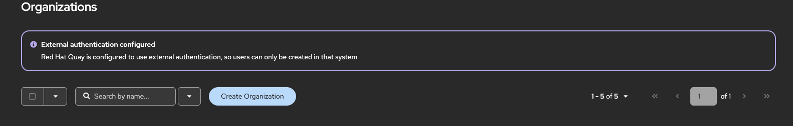
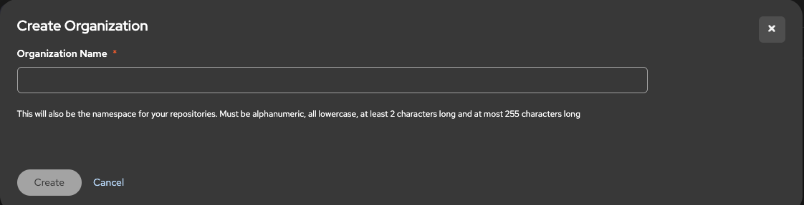
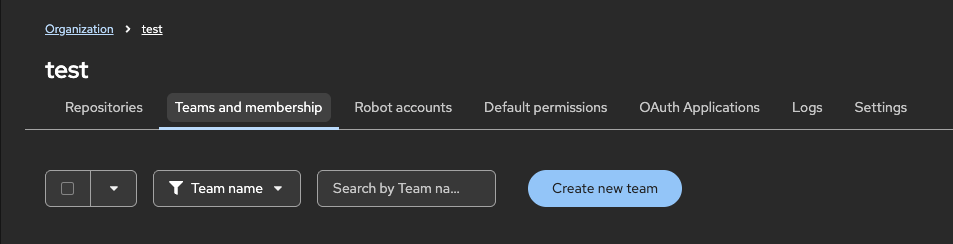
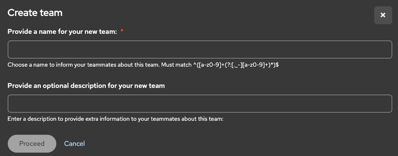
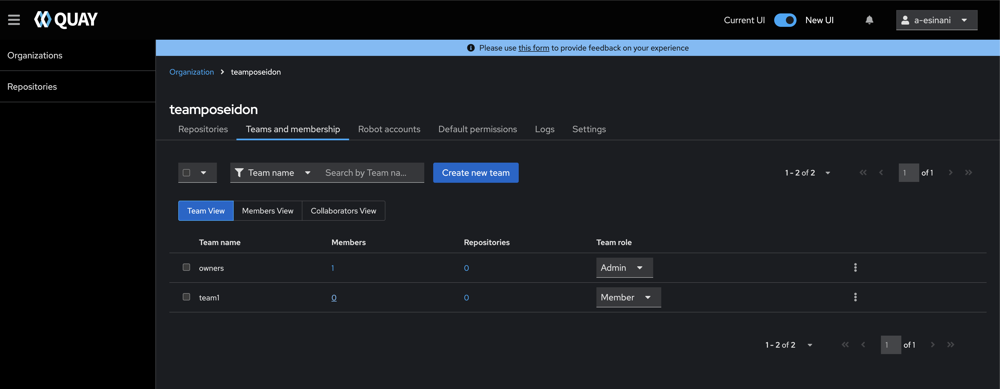
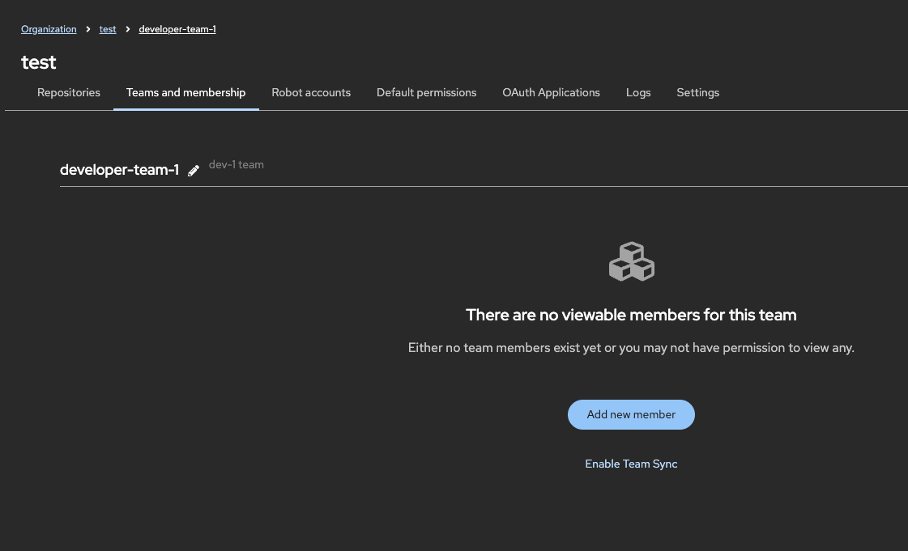
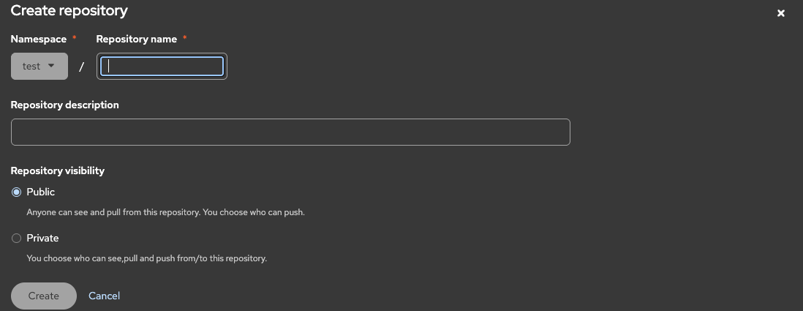

# Managing Quay

This guide covers how to create organizations, teams, and repositories in Quay.

## Creating Organizations & Teams

### 1. Create an Organization

1. In the top navigation, click **New Organization**.
    
2. Enter a name and description.
    
3. Click **Create**.

### 2. Create a Team

1. Open your organization and go to **Teams and memberships**.

2. Click **Create Team**.
   
   

3. Give the team a name, for example `developer-team-1`, `ci-cd`, or `admins`.

4. Review the details and click **Finish**.

### Adding Team Members

There are two ways to add members to a team:

- **Manually** – Add members by email or username. The user must have logged in to Quay at least once before they can be added.
- **Via Azure** – Connect an Entra ID (Azure) group using its Object ID, and members are synced automatically.

#### Add members manually

1. Open your team from the organization's **Teams and memberships** page.
2. Add each member by their email or username.
3. Set a role for each member (see [Team Roles](#team-roles) below).

#### Add members through Azure

1. Open your team from the organization's **Teams and memberships** page.
    

2. Select the team you want to sync.
    

3. Click **Enable Team Sync** and enter the Object ID of the group from Entra ID.

Once someone in the Entra ID group logs into Quay, they will only see the organization and team they belong to.

#### Team Roles

Assign each member one of the following roles:

- **Admin** – Full control over settings, repositories, and teams.
- **Write** – Can push and pull images.
- **Read** – Can only pull images.

### Best Practices

- Follow the principle of **least privilege**. For example, give developers read access unless they need more.

## Working with Repositories

### 1. Create a Repository

1. From the organization, click **New Repository**.
    

2. Enter a name and set the visibility:
    - **Public** – Anyone can pull the images.
    - **Private** – Only authorized users and teams can access it.

3. Click **Create Repository**.

### Best Practices

- **Keep repositories private.** Unless the images are meant for public use, private repositories are the safer default.

