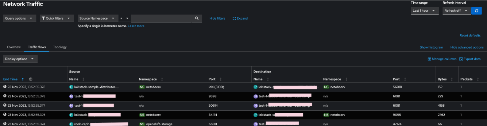

---
Author: Ersan Sinani
Title: Network Observability
Version: 0.1.0
externally-exposed: false
--- 

# Configure to use Network Observability

## Introduction

The Network Observability Operator enables administrators to observe and analyze network traffic flows for OpenShift Container Platform clusters. 

## Getting Started

To begin using the Network Observability Operator:

1. **Install the Operator**: Follow the instructions provided in the OpenShift documentation to install the Network Observability Operator.
2. **Create a FlowCollector**: Set up a FlowCollector resource to start gathering network flow data.
3. **Observe Network Traffic**: Navigate to the 'Network Traffic' menu under 'Observe' to access the dashboard.

## Network Observability Operator Overview

The Network Observability Operator is a critical component for developers looking to understand and monitor their network infrastructure within Kubernetes and OpenShift environments. This operator provides insights into network flows and helps maintain network visibility.

## Dashboard Overview

The Network Observability dashboard is your command center for monitoring network traffic. It provides a comprehensive view of traffic flows, topology, and detailed metrics.

*Figure 1: Dashboard Overview*

Features include:

- **Top 5 Average and Latest Rates**: Visualize the most active network flows.
- **Flow Rates Over Time**: Observe the trends and fluctuations in network traffic.

## Analyzing Traffic Flows

The 'Traffic Flows' panel offers a granular look at the individual network packets and bytes transmitted over the network. Use this to identify the top contributors to network traffic and pinpoint any unusual activity.

*Figure 2: Analyzing Traffic Flows*

Here you can find:

- **Query Options**: Customize what network flows are shown based on source, destination, or both.
- **Quick Filters**: Quickly exclude infrastructure traffic or focus on specific namespaces.
- **Time Range and Refresh**: Set the period for data display and the refresh rate for real-time updates.

## Topology View

The Topology view provides a dynamic graphical representation of network traffic, allowing you to see how traffic is flowing between nodes and services within your cluster.

*Figure 3: Topology View*

Highlights:

- **Edge Labels**: Choose to display the latest rate, average rate, bytes, or packets.
- **Graph Vertices**: Represents the network entities, such as pods and services.
- **Grouping and Layout**: Organize and display your network topology.

