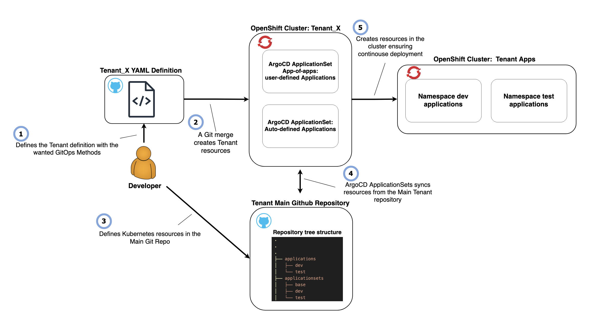

# Introduction to GitOps
This page introduces how to use OpenShift GitOps with Argo CD to manage and deploy Kubernetes resources from Git. 

**Official Documentation:** 

- [OpenShift GitOps](https://docs.openshift.com/container-platform/latest/cicd/gitops/understanding-openshift-gitops.html)
- [ArgoCD](https://argo-cd.readthedocs.io/en/stable/)

## Benefits

GitOps uses Git repositories as the single source of truth. ArgoCD ensures cluster state matches repository definitions.

Key benefits:

- **Faster releases:** Automated deployments
- **Improved reliability:** Consistent environments, reduced drift
- **Enhanced security:** Auditable, compliant deployments
  

## Workflow

1. Define tenant with desired GitOps method → submit to OCP Admin ([Tenant Quick Start](../../OpenShift%20Tenants/Orderopenshift-tenant-quick-start-guide.md))
2. Choose `user-defined` and/or `auto-defined` application creation methods ([GitOps Setup](gitops-setup.md#gitops-methods))
3. Define Kubernetes resources in tenant's main Git repository ([Getting Started](gitops-setup.md#getting-started))
4. ArgoCD syncs resources from repository to cluster

## Best Practices

See [GitOps Best Practices](gitops-best-practices.md) for ArgoCD implementation guidelines.