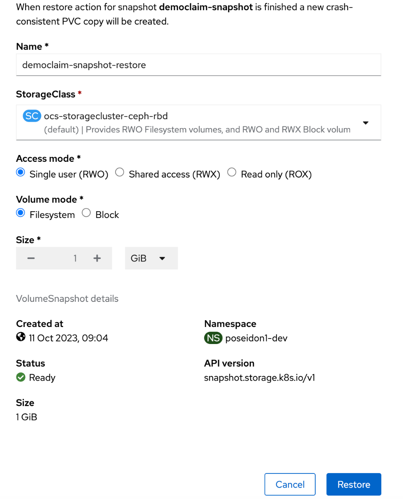

---
Author: Marcus Notø
Title: OpenShift Storage
Version: 1.0.0
externally-exposed: true
--- 

# OpenShift Storage

## Introduction
Effective storage management is critical for successful application deployment and management in OpenShift. This guide provides comprehensive insights into StorageClasses, Persistent Volumes (PV), and Persistent Volume Claims (PVC) to help you efficiently manage storage resources.

OpenShift Storage relies on **OpenShift Data Foundation** (ODF) to deliver Persistent Volumes (PVs) with *read-write-once* (RWO) and *read-write-many* (RWX) capabilities, meeting the diverse storage requirements of OpenShift Container Platform (OCP) workloads.

## StorageClasses
StorageClasses are a pivotal component of OpenShift Data Foundation (ODF). They enable you to define various storage configurations with specific properties, simplifying the provisioning of storage resources for your containerized workloads.

ODF offers several storage classes tailored to meet different application requirements:

* **`ocs-storagecluster-ceph-rbd`:** This default StorageClass is ideal for workloads that require Read-Write-Once (RWO) capabilities. It provides RWO Filesystem volumes and RWO/RWX Block volumes. 

* **`ocs-storagecluster-cephfs`:**  This storage class is recommended for use when your applications need Read-Write-Many (RWX) capabilities. It provides RWO and RWX Filesystem volumes, making it suitable for scenarios where multiple pods need simultaneous access to the same data.

* **`ocs-storagecluster-ceph-rgw`:**  If you prefer Ceph technology for Object Bucket Claims (OBCs), this storage class is available.

* **`openshift-storage.noobaa.io`:** This storage class is available if you prefer NooBaa technology for Object Bucket Claims (OBCs).

For Object storage, it is recommended to store such data outside of the OpenShift cluster in a dedicated Object Storage database. Therefore, it's best to utilize the file system storage classes: `ocs-storagecluster-ceph-rbd` (RWO) and `ocs-storagecluster-cephfs` (RWX).


## Persistent Volumes
Persistent Volumes (PVs) are a cornerstone of OpenShift's storage system. A PV represents a storage provisioned on the cluster, abstracting the underlying storage infrastructure. This abstraction allows you to claim storage resources without concern for the specifics of where or how the storage is provided.

Creating a PV in OpenShift Data Foundation (ODF) is done by creating a Persistent Volume Claim (PVC) and binding it to your application. Here's how it works:

1. **Create a Persistent Volume Claim (PVC)**
To request the storage resources your application needs, craft a PVC. Define the desired storage size, access modes, and reference the appropriate StorageClass. Here's an example:

    ```yaml
    apiVersion: v1
    kind: PersistentVolumeClaim
    metadata:
      name: my-app-pvc
    spec:
      accessModes:
        - ReadWriteOnce
      resources:
        requests:
          storage: 10Gi
      storageClassName: ocs-storagecluster-ceph-rbd
    ```

2. **Bind the PVC to Your Application**

    Binding the PVC to your application automatically generates a PV that matches the PVC's criteria. There's no need to create the PV manually. 

    ```yaml
    apiVersion: v1
    kind: Pod
    metadata:
      name: my-app-pod
    spec:
      containers:
        - name: my-app-container
          image: my-app-image:latest
          volumeMounts:
            - name: my-app-volume
              mountPath: /path/to/mount
      volumes:
        - name: my-app-volume
          persistentVolumeClaim:
            claimName: my-app-pvc
    ```

With this configuration, your application pod has access to the requested PV and you application can store data on the cluster. It's that simple!

## Backup and restore persistent volumes

Container Platform as a Service allows developers to take point-in-time snapshots of persistent volume claims and restore the snapshots to a new persistent volume claim.

1. Navigate to Storage -> PersistentVolumeClaims in the OpenShift console.


2. Click the three dots to the right of the pvc you want to snapshot.


3. Proceed with default settings, and click "Create"


4. Navigate to Storage -> VolumeSnapshots to find your recently created snapshot.


5. To restore a PVC from the snapshot click the three dots next to the right of the VolumeSnapshot.


6. Proceed with default settings to create a new pvc.


7. Find your restored snapshot under Storage -> PersistentVolumeClaims.


