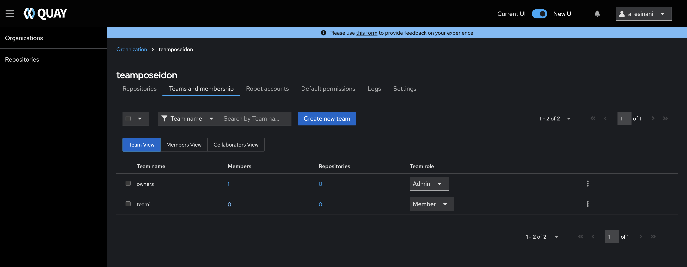

# Using Quay

This guide will walk you through creating organizations, teams, and repositories.

## Creating Organizations & Teams

### 1. Create an Organization

1. In the top navigation, click **New Organizations**.
    
2. Enter a name and description.
    
4. Click **Create**.
    

### 2. Create Teams

1. Inside your organization, go to **Teams**.

2. Click **Create Team**.
   
   

3. Name your team (e.g., `devs`, `ci-cd`, `admins`).

4. Add the necessary team members.
   

   You can add members in two ways:

   * **Manually** – Assign team members by email or username. The user must have logged in at least once to exist in Quay.
   * **Via Azure** – Add members by connecting an Azure group using its Object ID. This method is slightly longer and requires:

     1. Switching to the new UI.

        

     2. Navigating to your organization.

        
        
     3. Selecting your team.
        

     4. Clicking **Enable Team Sync** and entering the Object ID from Entra ID.

Once users in the Entra ID group log into Quay, they will only be able to see the organization and team they belong to.

5. Set roles for team members:

   * **Admin** – Full control over settings, repositories, and teams.
   * **Write** – Can push images.
   * **Read** – Can only pull images.
        
### Best Practices

- Apply **least-privilege access** with teams (e.g., give developers read access).

## Working with Repositories

### 1. Create a Repository

1. From the organization, create **New Repository**

    
2. Enter a name and set visibility:
    
    - **Public** – Anyone can pull images.
        
    - **Private** – Restricted to authorized users/teams.
        
3. Click **Create Repository**.

### Best Practice
**Keep Repositories Private** – Unless images are meant for public use, prefer private repositories for security
