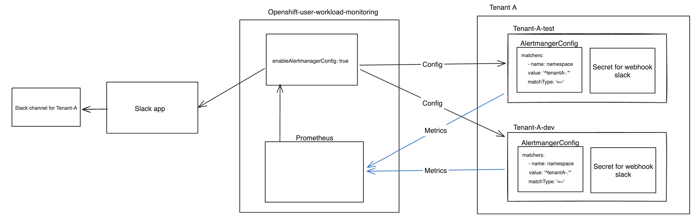

# Slack Alert Integration with Helm Chart

This guide provides a comprehensive walkthrough for setting up Slack alerts within your applications, leveraging Helm charts for dynamic configuration. A unique feature of this setup is the automatic generation of an `AlertmanagerConfig` for each environment specified during the tenant ordering process. For instance, if a tenant is provisioned with `test` and `dev` environments, individual `AlertmanagerConfig` resources will be created for both, ensuring tailored alert management across different stages of your application lifecycle.

## Design overview
### alertmanagerConfig for Slack

This diagram represents a monitoring setup for an OpenShift environment using Prometheus and Slack for notifications.


### Alertmanager for platform-metrics
The diagram outlines another monitoring setup within an OpenShift environment, focusing on cluster-wide metrics and notifications for administrative purposes.


## Prerequisites

- You must have a Slack channel ready for receiving alerts.


## Creating a Slack Webhook via a Slack App

To send alerts to a Slack channel, you first need to create a Slack app and configure a webhook. Follow these steps:

### 1. Create a New Slack App:
   - Go to the [Slack API](https://api.slack.com/apps) page and click on "Create New App".
   - Choose "From scratch", enter your App Name, and select the Slack Workspace where the app will be installed.
### 2. Activate Incoming Webhooks:
   - In the "Features" section on the sidebar, click on "Incoming Webhooks".
   - Toggle the switch to activate incoming webhooks.
### 3. Create a Webhook URL for Your Slack Channel:
   - Click on "Add New Webhook to Workspace".
   - Choose the channel where you want to receive alerts and click "Allow".
   - Slack will generate a Webhook URL; this URL will be used in your alerting configuration.
### 4. Secure Your Webhook URL:
   - You then have to encrypt your Webhook URL using SealedSecrets for Kubernetes. Follow the instructions provided below.

## Encrypt secret with kubeseal

### 1. Base64 encode webhook
* The webhook-URL you have generated from your Slack app needs to be stored in a secret, which you apply to your desired namespace. The first step is to base64 encode the webhook URL:

```yaml
echo -n <webhook-url> | base64
```

### 2. Encrypt the Secret with Kubeseal
* Paste the encoded URL in the secret and change the name of the secret. This secret name is not important as we only need the encrypted url.

```yaml
apiVersion: v1
kind: Secret
metadata:
  name: <secret name> # not important as you only need the encrypted url
type: Opaque
data:
  url: <base64 encoded webhook>
```

To seal the secret with `kubeseal`, you can use the following command:

```bash
kubeseal --cert /path/to/pub.cert --scope cluster-wide -f secret.yaml -o yaml > sealed_secret.yaml
```

Replace `/path/to/pub.cert` with the path to your public certificate. `secret.yaml` is the path to the Secret YAML file you created in the first step. The sealed secret will be outputted to `sealed_secret.yaml`.

**Read more about encrypting a secret with kubeseal from this** [guide](../Secret%20Managment/encrypting-secret-with-kubeseal.md)

## Helm Chart Configuration for Slack Alerts

After setting up your Slack webhook, you need to configure your Helm chart to use this webhook for alerting.

### Configuration Parameters

| Parameter                                                     | Description                                                                                                                                |
| ------------------------------------------------------------- | ------------------------------------------------------------------------------------------------------------------------------------------ |
| `slack_alert_integration.enable`                              | Set to `True` to enable Slack alert integration.                                                                                           |
| `slack_alert_integration.channel_name`                        | Specify the name of the Slack channel to receive alerts.                                                                                   |
| `slack_alert_integration.alert_severity`                      | Define the severity of alerts to be sent (e.g., `critical`, `warning`, `info`). For multiple severities, separate them with a pipe (`\|`). |
| `slack_alert_integration.webhook_secret.encrypted_webhookURL` | Encrypted Slack webhook URL.                                                                                                               |

### 1. Update your tenant definition, e.g `values.yml`: 
Define your Slack alerting configurations in for your Helm chart.

```yaml title="values.yml"
slack_alert_integration:
  enable: True
  channel_name: "<your-slack-channel-name>"
  alert_severity: "critical"  # Can be one or multiple from: critical|warning|info
  webhook_secret:
    encrypted_webhookURL: "<your-encrypted-webhook-url>"
```


### 2. Deploy Your Helm Chart:
With the `values.yml` configured, deploy your Helm chart to apply the Slack alert integration settings. The Helm chart will use the configurations from `values.yml` to set up `AlertmanagerConfig` and `SealedSecret` resources as necessary.


## Understanding AlertmanagerConfig Matchers

The `AlertmanagerConfig` uses matchers for alert routing based on specific criteria. Here's a breakdown of the matchers used in our configuration.


### Matchers Explained

- **Severity Matcher:** This matcher filters alerts based on their severity level, allowing alerts to be categorized and routed appropriately. For example, setting the `value` to `critical` ensures only alerts marked as critical are processed by this configuration. 

- **Namespace Matcher:** This matcher is designed to ensure the `AlertmanagerConfig` only processes alerts originating from namespaces related to the specific environment it's associated with. The `value: '^{{ $.Values.namespace.name }}-.*'` uses a regular expression to match any namespace that starts with the environment's name followed by any characters, ensuring a broad but targeted alert capture. The `matchType: '=~'` indicates that the match is based on a regular expression pattern.

```yaml
...
    matchers:
    - name: severity
      value: {{ $.Values.slack_alert_integration.alert_severity}}
      matchType: '='
    - name: namespace
      value: '^{{ $.Values.namespace.name }}-.*'
      matchType: '=~'
...
```

#### Example Scenario:

1. **Alert Generation:** An application running in the namespace `developer-namespace-test` encounters a critical issue, generating an alert with the severity label set to `critical`.
    
2. **Alert Matching:**
    - The `severity` matcher checks if the alert's severity is `critical`. Since the alert matches this criterion, it passes the first filter.
    - The `namespace` matcher uses a regular expression to check if the alert originates from a namespace starting with `developer-namespace-`. In this case, `developer-namespace-test` matches the pattern, so the alert passes the second filter as well.
3. **Alert Routing:** Since the alert satisfies both matchers, it is routed to the configured Slack channel specified in the `AlertmanagerConfig`. Team members in the channel are then notified of the critical issue for immediate attention.


## (Optional) Create test alert

Change the needed variables and apply the prometheus rule in your environment to send a alert to Slack. 

!!! Note
    Edit the `metadata.namespace` to a namespace in your cluster

```yaml title="test-alert.yml" hl_lines="10"
apiVersion: monitoring.coreos.com/v1
kind: PrometheusRule
metadata:
  labels:
    app.kubernetes.io/name: custom-monitoring-rules
    app.kubernetes.io/part-of: openshift-monitoring
    prometheus: k8s
    role: alert-rules
  name: test-alarm
  namespace: <NAMESPACE>
spec:
  groups:
  - name: Test for sending an immediate alarm
    rules:
    - alert: TestAlert
      expr: vector(1) > 0 
      labels:
        severity: critical
      annotations:
        summary: "This is a test alert"
        description: "This alert is for testing purposes"
```

After a few minutes, you can expect to see an alert in Slack looking something like this:


  

And when the alarm is `RESOLVED` you can expect something like this:


  
  
