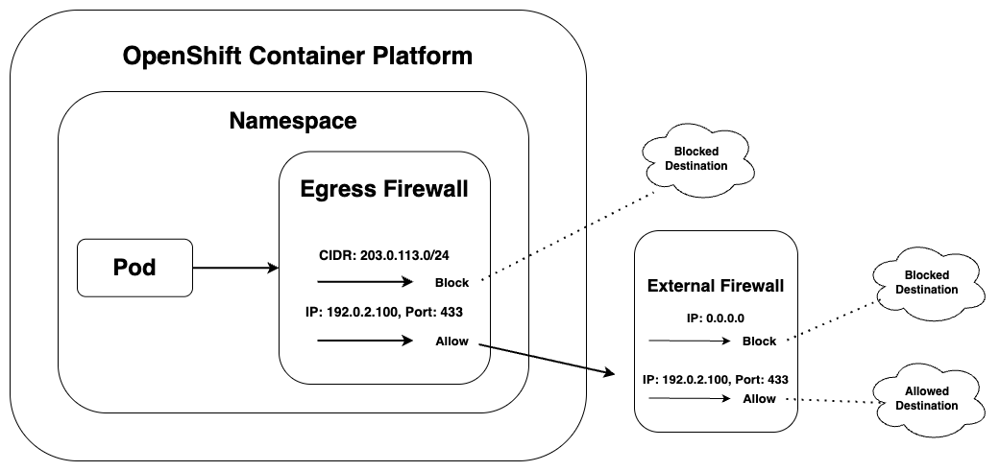

# Egress Firewall

## Introduction

The Egress Firewall in OpenShift allows you to control outbound traffic from Pods to external networks at the namespace level. It defines rules to explicitly allow or block egress connections to specific IPs, CIDRs, or ports.

This is particularly useful for securing workloads by limiting what external services they can access (e.g., blocking internet access or allowing only specific APIs).



## How to use Egress Firewall

<!-- EgressFirewall in OpenShift is a custom resource that applies namespace-scoped rules to control outbound traffic. It allows filtering based on destination CIDRs, ports, and protocols. EgressFirewall enhances security by blocking unauthorized external access, supports compliance by preventing data leaks and bypassing of monitoring systems, and enables traceability by routing traffic through static IPs using EgressIP. It offers fine-grained, namespace-level control without affecting the entire cluster, and fits seamlessly into GitOps workflows by being declarative, version-controlled, and automatable with tools like Argo CD. -->

Egress firewall can be enabled in each tenant by enabling the `enable_egress_firewall` field under `namespace` in the tenant chart. By enabling this field an egress firewall for each environment in the tenant gets defined based on the following fields: `openshift_dhcp_range_main`, `openshift_dhcp_range_dr`, `external_URLs`, `external_IPs`, `enable_global_egress_IPs`, `udp_IPs`, `udpURLs` and `allow_to_internet`.

How to enable egress firewall:

```yml title="enable_firewall.yml"
namespace:
  name: ""
  use_egress_firewall: true # If true - Egress Firewall Resource will get created for each namespace in the tenant
```

## Global Egress Firewall Openings

If there are some firewall openings that persist over multiple tenants  and environments in a cluster, these can be defined as global variables to reduce configuration overhead. These firewall openings are stored in a global variables file and is enabled in a tenant when the 'enable_global_egress_IPs' variable under 'namespace' is set to True. To enable this it is also required that the 'use_egress_firewall' variable is set to True. Below is an example of enabling global egress firewall openings:

```yml title="tenant.yml"
  namespace:
    name: ""
    description: ""
    displayName: ""
    use_egress_firewall: true # Enables egress firewall
    enable_global_egress_IPs: true # If set to true - global egress firewall openings are included in the egress firewall of the environments in the tenant
```

