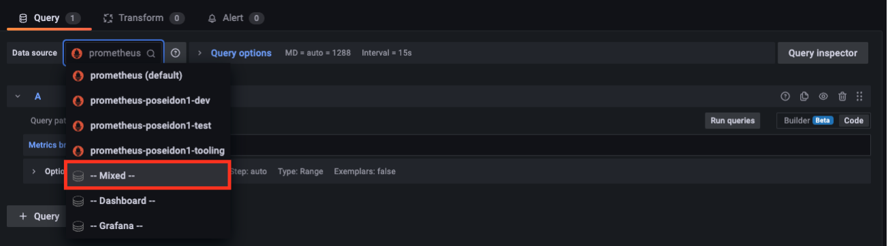
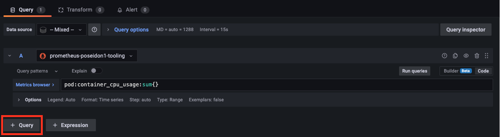
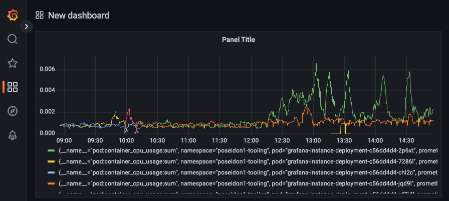

---
Author: Simen Haga, Ersan Sinani
Title: Configure grafana and Thanos Query
Version: 1.0.0
externally-exposed: True
--- 


# Configure grafana and Thanos Query 

This user guide provides a process of configuring and setting up Grafana with Thanos Query using the provided Tenant service account and Grafana datasource template. 


## Introduction

This Bash script is intended to create a data source for a Grafana instance set up on an OpenShift cluster. The script will check that specific prerequisites are met before running and provide feedback on any issues.

The script will check that all prerequisites are met before creating a data source per namespace in the tenant for the Grafana instance. It will retrieve a token for the "serviceaccount" that the script uses and then render a template file to new files containing the correct variables for your namespaces in the cluster. Finally, the script will create the datasources in the OpenShift cluster and provide feedback on whether the creation was successful or not. The script will loop through all your namespaces in the provided tenant and set a custom query parameter in the datasource like this `customQueryParameter="namespace=${namespace}"`.

## Prerequisites for the script

- In the tenant definition ensure that the `enable_tooling` is set to `true` so that the tooling-namespace and service account is deployed to your tenant. 
- In the tenant definition ensure that the `deploy_grfana`is set to `true`, so that a Grafana instance is deployed in the tooling-namespace.


## User guide

1. In your chosen directory create the files `create_datasource.sh` and `grafana-datasource-template.yml` provided at the end of this user guide [here](#create_datasourcesh).
2. Run the command to give the script execute permission.
    ```bash
    sudo chmod +x create_datasource.sh
    ```
3. Run the script with the command `./create_datasource.sh <tenant>`, where `<tenant>` is the name of the OpenShift tenant you are using.
    ```bash
    ./create_datasource.sh <tenant>
    ```
4. If the script returns an error, please follow the instructions provided in the output.
5. If the script runs successfully, you'll see a couple of new files called `grafana-datasource-<namespace>.yml` in your working directory. You should have a datasource per namespace in your tenant.


### Login to Grafana dashboard
1. Make sure you are in the correct OpenShift project.
```bash
oc project <namespace>-tooling
```

2. Run the following command to get the route to Grafana.
```bash
oc get route
```
3. Copy the route from the **HOST/PORT** field and paste the route into your desired web browser. Remember to use `https://`. It should look similar to the example below.
```bash
https://grafana-instance-service-<NAMESPACE>-tooling.apps.<CLUSTER>.cp.<COMPANY.DOMAIN>
```
4. Login using Username **admin** and extract the **password** using the following command:
```bash
oc extract secret/grafana-instance-admin-credentials --to=-
```


### Create a simple dashboard that query multiple datasources

1. Inside Grafana choose **Dashboards**
2. Click on **New** and then **Add a new panel**
3. In the Query window, select Mixed as the data source.

4. In query A selecet the first data sources you will like to query

5. Write a query and clik on **Run queries**. A simple query to start with could be:
```query
pod:container_cpu_usage:sum{}
```
6. To query another datasource click on **+ Query** and repeat steps 4. and 5.

7. To apply these queries to your new dashboard click on **Apply** in the top right corner.
8. The end results should look similar to this, if you have any pods running that are consuming CPU.



## create_datasource.sh
```bash
#! /bin/bash

#Instructions of use
#
# 1. Open a terminal and navigate to the directory where the script and "grafana-datasource-template.yml" files are located.
# 2. Run the command "chmod +x create_datasource.sh" to give the script execute permission.
#    	sudo chmod +x create_datasource.sh
# 3. Run the script with the command "./create_datasource.sh <tenant>" (where "<tenant>" is the name of the OpenShift tenant you are using).
#   	./create_datasource.sh <tenant>
# 4. Follow the feedback from the script to see if any issues arise.
# 5. If the script runs sucsessfully you'll see some new files called "_grafana-datasource-<namespace>.yml_" in your working directory."
#
#

######### SCRIPT PREREQUISITES #########
echo "Verify script prerequisites"

if [ -z "$1" ]
  then
    echo "No argument supplied. Example usage: ./create_datasource.sh MYTENANTNAME"
    exit
fi

oc whoami > /dev/null 2>/dev/null
exit_code=$?
if [ $exit_code -ne 0 ]
then
  echo "Please log in to cluster before running this script."
  exit
fi

oc get namespace $1-tooling > /dev/null 2>/dev/null
exit_code=$?
if [ $exit_code -ne 0 ]
then
  echo "Make sure your OpenShift tenant is set up with namespace.enable_tooling: true. Contact Sopra Steria to fix this."
  exit
fi

ls grafana-datasource-template.yml > /dev/null 2>/dev/null
exit_code=$?
if [ $exit_code -ne 0 ]
then
  echo "Could not find file: grafana-datasource-template.yml in folder $(pwd). Make sure you follow the user guide from Sopra Steria when setting up the Grafana datasource."
  exit
fi

oc get sa $1-tooling -n $1-tooling > /dev/null 2>/dev/null
exit_code=$?
if [ $exit_code -ne 0 ]
then
  echo "Make sure serviceaccount exists. Contact Sopra Steria to fix this."
  exit
fi

oc get grafana grafana-instance -n $1-tooling > /dev/null 2>/dev/null
exit_code=$?
if [ $exit_code -ne 0 ]
then
  echo "WARNING: Could not find grafana grafana-instance. Make sure grafana is running to make use of datasource."
fi

echo "Prerequisites verified - OK"


######### START SCRIPT #########
export dashboard_name=$1-tooling
export tooling_namespace=$1-tooling
export datasource_query=$1-tooling
export datasource_namespaces=$(oc get project -l soprasteria/tenant=$1 --no-headers | cut -f1 -d " ")

for ns in $datasource_namespaces; do 
  export namespace=$ns    

  echo "Fetching secret for serviceaccount $1-tooling"
  export mysecret=$(oc get secret -n $1-tooling | grep $1-tooling-token | cut -f1 -d ' ')
  # Throw error if mysecret is not correctly found
  echo "Secret fetched"

  echo "Extracting token for serviceaccount $1-tooling"
  export mytoken=$(oc get secret $mysecret -n $1-tooling -o jsonpath={.data.token} | base64 -d)
  # Throw error if token is not extracted
  echo "Token extracted"

  echo "Rendering template grafana-datasource-template.yml to file grafana-datasoruce-$namespace.yml"
  cat grafana-datasource-template.yml | envsubst > grafana-datasource-$namespace.yml
  echo "Template rendered to grafana-datasource.yml"
  
  echo "Creating datasource in OpenShift-cluster in namespace $1-tooling"
  oc apply -f grafana-datasource-$namespace.yml
  echo "Created datasource $namespace-datasource in namespace $1-tooling"
done
```

## grafana-datasource-template.yml

```yaml title="grafana-datasource-template.yml"
apiVersion: grafana.integreatly.org/v1beta1
kind: GrafanaDatasource
metadata:
  name: "${namespace}-datasource" 
  namespace: "${tooling_namespace}" 
spec:
  instanceSelector:
    matchLabels:
      dashboards: "${dashboard_name}"
  datasource:
    name: prometheus-${namespace}
    type: prometheus
    access: proxy
    basicAuth: true
    url: 'https://thanos-querier.openshift-monitoring.svc.cluster.local:9092'
    isDefault: true
    jsonData:
      "tlsSkipVerify": true
      "timeInterval": "5s"
      "httpHeaderName1": "Authorization"
      customQueryParameters: "namespace=${namespace}"
    secureJsonData:
      httpHeaderValue1: 'Bearer ${mytoken}' 
    editable: true
```