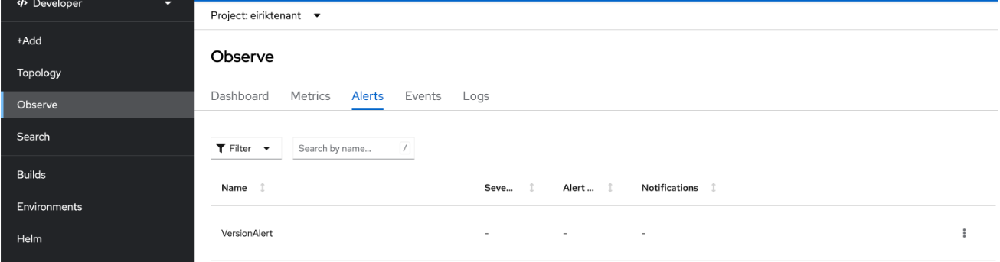

---
Author: Ersan Sinani
Title: Configure monitoring for applications
Version: 1.0.0
externally-exposed: true
--- 

# Configuring Monitoring for A Tenant

## Prerequisites

* An OpenShift tenant created by Sopra Steria

## Introduction
Prometheus alerts are a vital part of maintaining the health and reliability of your systems and services. By defining alerting rules, you can tailor your monitoring to specific requirements and respond swiftly to issues as they arise. Understanding the alerting workflow and leveraging the Alert Manager for notifications will help you build a robust and efficient alerting system with Prometheus.

This user guide will provide you with further insights and detailed instructions on managing and creating alerts in Openshift.

## Overview of Alerts
We have created a set of alerts tailored to enhance your monitoring and alerting capabilities within your Prometheus environment. These alerts are designed to help you proactively identify issues and ensure the smooth operation of your systems and services. Below, we provide an overview of the various alert groups we've developed for you to use effectively. Each group is carefully crafted to address specific aspects of your infrastructure and applications, empowering you to take action swiftly when needed. Explore the following alert groups to gain deeper insights into your monitoring and make informed decisions.

### Container Alerts

- This group of alerts focuses on monitoring Kubernetes containers. These alerts help you stay informed about container-related issues that may affect your applications.
- `KubernetesContainerOomKiller`: This alert triggers when a Kubernetes container is OOM-killed.

### Job & CronJob Alerts

- This group of alerts focuses on monitoring Kubernetes jobs and cron jobs. These alerts help you keep track of job and cron job executions and potential issues.
- `KubernetesJobFailed`: This alert triggers when a Kubernetes job fails to complete.
- `KubernetesCronjobSuspended`: This alert triggers when a Kubernetes CronJob is suspended.
- `KubernetesCronjobTooLong`: This alert triggers when a Kubernetes CronJob takes too long to complete.

### Storage Alerts

- This group of alerts focuses on monitoring Kubernetes storage and persistent volume claims. These alerts help you maintain storage reliability.
- `KubernetesPersistentvolumeclaimPending`: This alert triggers when a PersistentVolumeClaim is in a pending state.
- `KubernetesVolumeOutOfDiskSpace`: This alert triggers when a volume is almost full.
- `KubernetesVolumeFullInFourDays`: This alert triggers when a volume is expected to fill up within four days.
- `KubernetesPersistentvolumeError`: This alert triggers when a Persistent Volume is in a bad state.

### Workload Alerts

- This group of alerts focuses on monitoring Kubernetes workloads, including StatefulSets, Horizontal Pod Autoscalers (HPAs), and pods. These alerts help you maintain the health and performance of your workloads.
- `KubernetesStatefulsetDown`: This alert triggers when a Kubernetes StatefulSet goes down.
- `KubernetesHpaScaleInability`: This alert triggers when an HPA is unable to scale.
- `KubernetesHpaMetricsUnavailability`: This alert triggers when an HPA is unable to collect metrics.
- `KubernetesHpaScaleMaximum`: This alert triggers when an HPA reaches its maximum scaling limit.
- `KubernetesHpaUnderutilized`: This alert triggers when an HPA is underutilized.
- `KubernetesPodNotHealthy`: This alert triggers when a pod is not healthy.
- `KubernetesPodCrashLooping`: This alert triggers when a pod is in a crash-loop.

### ReplicaSets Alerts

- This group of alerts focuses on monitoring Kubernetes ReplicaSets. These alerts help you maintain the desired number of replicas.
- `KubernetesReplicasetReplicasMismatch`: This alert triggers when a Kubernetes ReplicaSet's desired replicas do not match the ready replicas.

### Deployments Alerts

- This group of alerts focuses on monitoring Kubernetes Deployments. These alerts help you ensure that your deployments are running smoothly.
- `KubernetesDeploymentReplicasMismatch`: This alert triggers when a Kubernetes Deployment's desired replicas do not match the available replicas.

### StatefulSets Alerts

- This group of alerts focuses on monitoring Kubernetes StatefulSets. These alerts help you ensure the correct behavior of your StatefulSets.
- `KubernetesStatefulsetReplicasMismatch`: This alert triggers when a Kubernetes StatefulSet's ready replicas do not match the total replicas.

### How to disable group alarms
To disable a group alert you need to set a group alert to false in your tenant configuration. 

```yaml
monitoring:
  containerAlertsEnabled: false  # Set to false to disable the ContainerAlerts group
  jobCronJobAlertsEnabled: true
  storageAlertsEnabled: true
  workloadAlertsEnabled: true
  replicasSetsAlertsEnabled: true
  deploymentsAlertsEnabled: true
  statefulSetsAlertsEnabled: true

```

## Configure your own alerts
If you want to make your own alerts you can do this by following the steps below. 

### Configure alerting rules for user-defined projects

Before you start configuring alerts for your project, please familiarize yourself with the best practices for alerting as described in [best-practices](https://docs.openshift.com/container-platform/4.12/monitoring/managing-alerts.html#Optimizing-alerting-for-user-defined-projects_managing-alerts). For a guide on how to create Prometheus rules using PromQL, please refer to the [prometheus documentation](https://prometheus.io/docs/prometheus/latest/configuration/alerting_rules/).

!!! Note 
    You will not be allowed to create resources directly in openshift-user-workload-monitoring, as this namespace is used across independent teams.


### Steps

1. Create a YAML definition for the alerting rules you want to create providing the namespace of your choice.

    ```yaml
    apiVersion: monitoring.coreos.com/v1
    kind: PrometheusRule
    metadata:
      name: example-alert
      namespace: <Tenant>
    spec:
      groups:
      - name: example
        rules:
        - alert: VersionAlert
          expr: version{job="prometheus-example-app"} == 0
    ```

2. Apply the alerting rule to the cluster. This should be done using GitOps to ensure tracability and transparency of configuration, as well as securing an automated setup if the tenant would have to be rebuilt at some point.

3. Verify that the alerting rules have been created by navigating to Observe --> Alerts for your project in the Developer view of the OpenShift console, as seen below.


## Sending notifications to external systems

You have access to configuring your Alertmanager configuration specific to your project. As for the alerting rules, all objects are project-scoped, so configure all your projects with the desired notification rules. 

!!! Warning
    Never store secrets in git. In the AlertmanagerConfig object below, you should reference secrets created using a secure secret handling system like sealed-secrets or external secrets. You should not type in authentication tokens or passwords directly in the AlertmanagerConfig object.


### Steps

1. Create a YAML definition for the Alertmanager configuration you want to create. An example is found below:

    ```yaml
    apiVersion: monitoring.coreos.com/v1beta1
    kind: AlertmanagerConfig
    metadata:
      name: example-routing
      namespace: <Tenant>
    spec:
      route:
        receiver: default
        groupBy: [job]
      receivers:
      - name: default
        webhookConfigs:
        - url: https://example.org/post
    ```

2. Apply the alerting rule to the cluster. This should be done using GitOps to ensure traceability and transparency of configuration, as well as securing an automated setup if the tenant has to be rebuilt at some point.
3. Verify that notifications are sent to the target when alerts are created. A routine for this will be documented shortly.

## Alert code examples

### Container Alerts

=== "KubernetesContainerOomKiller"
    ```yaml
    alert: KubernetesContainerOomKiller
    expr: (kube_pod_container_status_restarts_total - kube_pod_container_status_restarts_total offset 10m >= 1) and ignoring(reason) min_over_time    (kube_pod_container_status_last_terminated_reason{reason="OOMKilled"}[10m]) == 1
    for: 0m
    labels:
      namespace: {{ $.Values.namespace.name }}-{{ .name }}
      severity: warning
    annotations:
      summary: "Kubernetes Container oom killer (instance {{`{{ $labels.instance }})`}}"
      description: "Container {{`{{ $labels.container }}`}} in pod {{`{{ $labels.namespace }}`}}/{{`{{ $labels.pod }}`}} has been OOMKilled {{`{{ $value }}`}} times in the     last 10 minutes.\n VALUE = {{`{{ $value }}`}}\n LABELS = {{`{{ $labels }}`}}"
    ```
=== "KubernetesJobSlowCompletion"
    ```yaml
    alert: KubernetesJobSlowCompletion
    expr: kube_job_spec_completions - kube_job_status_succeeded - kube_job_status_failed > 0
    for: 12h
    labels:
      namespace: {{ $.Values.namespace.name }}-{{ .name }}
      severity: critical
    annotations:
      summary: "Kubernetes Job failed (instance {{`{{ $labels.instance }}`}})"
      description: "Job {{`{{ $labels.namespace }}`}}/{{`{{ $labels.job_name }}`}} failed to complete\n  VALUE = {{`{{ $value }}`}}\n  LABELS = {{`{{ $labels }}`}}"
    
    ```


### Job & CronJob Alerts
=== "KubernetesJobFailed"
    ```yaml
    alert: KubernetesJobFailed
    expr: kube_job_status_failed > 0
    for: 0m
    labels:
      namespace: {{ $.Values.namespace.name }}-{{ .name }}
      severity: warning
    annotations:
      summary: 'Kubernetes Job failed (instance {{`{{ $labels.instance }})`}}'
      description: "Job {{`{{ $labels.namespace }}`}}/{{`{{ $labels.job_name }}`}} failed to complete\n  VALUE = {{`{{ $value }}`}}\n LABELS = {{`{{ $labels }}`}}"
    ```
=== "KubernetesCronjobSuspended"
    ```yaml
    alert: KubernetesCronjobSuspended
    expr: kube_cronjob_spec_suspend != 0
    for: 0m
    labels:
      namespace: {{ $.Values.namespace.name }}-{{ .name }}
      severity: warning
    annotations:
      summary: 'Kubernetes CronJob suspended (instance {{`{{ $labels.instance }}`}})'
      description: "CronJob {{`{{ $labels.namespace }}`}}/{{`{{ $labels.cronjob }}`}} is suspended\n  VALUE = {{`{{ $value }}`}}\n LABELS = {{`{{ $labels }}`}}"
    ```

=== "KubernetesCronjobTooLong"
    ```yaml
    alert: KubernetesCronjobTooLong
    expr: time() - kube_cronjob_next_schedule_time > 3600
    for: 0m
    labels:
      namespace: {{ $.Values.namespace.name }}-{{ .name }}
      severity: warning
    annotations:
      summary: 'Kubernetes CronJob too long (instance {{`{{ $labels.instance}}`}})'
      description: "CronJob {{`{{ $labels.namespace }}`}}/{{`{{ $labels.cronjob }}`}} is taking more than 1h to complete.\n  VALUE = {{`{{ $value }}`}}\n LABELS = {{`{{     $labels }}`}}"
    ```


### Storage Alerts

=== "KubernetesPersistentvolumeclaimPending"
    ```yaml
    alert: KubernetesPersistentvolumeclaimPending
    expr: kube_persistentvolumeclaim_status_phase{phase="Pending"} == 1
    for: 2m
    labels:
      namespace: {{ $.Values.namespace.name }}-{{ .name }}
      severity: warning
    annotations:
      summary: 'Kubernetes PersistentVolumeClaim pending (instance {{`{{ $labels.instance }}`}})'
      description: "PersistentVolumeClaim {{`{{ $labels.namespace }}`}}/{{`{{ $labels.persistentvolumeclaim }}`}} is pending\n  VALUE = {{`{{ $value }}`}}\n LABELS = {{`{{ $labels }}`}}"
    ```

=== "KubernetesVolumeOutOfDiskSpace"
    ```yaml
    alert: KubernetesVolumeOutOfDiskSpace
    expr: (kubelet_volume_stats_available_bytes / kubelet_volume_stats_capacity_bytes) * 100 < 10
    for: 2m
    labels:
      namespace: {{ $.Values.namespace.name }}-{{ .name }}
      severity: warning
    annotations:
      summary: 'Kubernetes Volume out of disk space (instance {{`{{ $labels.instance }}`}})'
      description: "Volume is almost full (< 10% left)\n VALUE = {{`{{  $value }}`}}\n LABELS = {{`{{ $labels }}`}}"
    ```

=== "KubernetesVolumeFullInFourDays"
    ```yaml
    alert: KubernetesVolumeFullInFourDays
    expr: predict_linear(kubelet_volume_stats_available_bytes[6h:5m], 4 * 24 * 3600) < 0
    for: 0m
    labels:
      namespace: {{ $.Values.namespace.name }}-{{ .name }}
      severity: critical
    annotations:
      summary: 'Kubernetes Volume full in four days (instance {{`{{ $labels.instance }})`}}'
      description: "Volume under {{`{{ $labels.namespace }}`}}/{{`{{ $labels.persistentvolumeclaim }}`}} is expected to fill up within four days. Currently {{`{{ $value humanize }}`}}% is available.\n VALUE = {{`{{ $value }}`}}\n LABELS = {{`{{ $labels }}`}}"
    ```
=== "KubernetesPersistentvolumeError"
    ```yaml
    alert: KubernetesPersistentvolumeError
    expr: kube_persistentvolume_status_phase{phase=~"Failed|Pending", job="kube-state-metrics"} > 0
    for: 0m
    labels:
      namespace: {{ $.Values.namespace.name }}-{{ .name }}
      severity: critical
    annotations:
      summary: 'Kubernetes PersistentVolume error (instance {{`{{ $labels.instance }})`}}'
      description: "Persistent volume {{`{{ $labels.persistentvolume }}`}} is in a bad state\n VALUE = {{`{{ $value }}`}}\n LABELS = {{`{{ $labels }}`}}"
    ```


### Workload Alerts

=== "KubernetesStatefulsetDown"
    ```yaml
    alert: KubernetesStatefulsetDown
    expr: kube_statefulset_replicas != kube_statefulset_status_replicas_ready > 0
    for: 1m
    labels:
      namespace: {{ $.Values.namespace.name }}-{{ .name }}
      severity: critical
    annotations:
      summary: 'Kubernetes StatefulSet down (instance {{`{{ $labels.instance }})`}}'
      description: "StatefulSet {{`{{ $labels.namespace }}`}}/{{`{{ $labels.statefulset }}`}} went down\n  VALUE = {{`{{ $value }}`}}\n  LABELS = {{`{{ $labels }}`}}"
    ```

=== "KubernetesHpaScaleInability"   
     ```yaml
     alert: KubernetesHpaScaleInability
     expr: kube_horizontalpodautoscaler_status_condition{status="false", condition="AbleToScale"} == 1
     for: 2m
     labels:
       namespace: {{ $.Values.namespace.name }}-{{ .name }}
       severity: warning
     annotations:
       summary: 'Kubernetes HPA scale inability (instance {{`{{ $labels.instance }})`}}'
       description: "HPA {{`{{ $labels.namespace }}`}}/{{`{{$labels.horizontalpodautoscaler }}`}} is unable to scale\n  VALUE = {{`{{ $value }}`}}\n LABELS = {{`{{ $labels }}`}}"
     ```

=== "KubernetesHpaMetricsUnavailability"
     ```yaml
     - alert: KubernetesHpaMetricsUnavailability
     expr: kube_horizontalpodautoscaler_status_condition{status="false", condition="ScalingActive"} == 1
     for: 0m
     labels:
       namespace: {{ $.Values.namespace.name }}-{{ .name }}
       severity: warning
     annotations:
       summary: 'Kubernetes HPA metrics unavailability (instance {{`{{ $labels.instance }})`}}'
       description: "HPA {{`{{ $labels.namespace }}`}}/{{`{{ $labels.horizontalpodautoscaler }}`}} is unable to collect metrics\n  VALUE = {{`{{ $value }}`}}\n LABELS = {{`{{ $labels }}`}}"
     ```

=== "KubernetesHpaScaleMaximum"     
    ```yaml
    alert: KubernetesHpaScaleMaximum
    expr: kube_horizontalpodautoscaler_status_desired_replicas >= kube_horizontalpodautoscaler_spec_max_replicas
    for: 2m
    labels:
      namespace: {{ $.Values.namespace.name }}-{{ .name }}
      severity: info
    annotations:
      summary: 'Kubernetes HPA scale maximum (instance {{`{{ $labels.instance }})`}}'
      description: "HPA {{`{{ $labels.namespace }}`}}/{{`{{ $labels.horizontalpodautoscaler }}`}} has hit the maximum number of desired pods\n  VALUE = {{`{{ $value }}`}}\n LABELS = {{`{{ $labels }}`}}"
    ```

=== "KubernetesHpaUnderutilized"
    ```yaml
    alert: KubernetesHpaUnderutilized
    expr: max(quantile_over_time(0.5, kube_horizontalpodautoscaler_status_desired_replicas[1d]) == kube_horizontalpodautoscaler_spec_min_replicas) by (horizontalpodautoscaler) > 3
    for: 0m
    labels:
      namespace: {{ $.Values.namespace.name }}-{{ .name }}
      severity: info
    annotations:
      summary: 'Kubernetes HPA underutilized (instance {{`{{ $labels.instance }})`}}'
      description: "HPA {{`{{ $labels.namespace }}`}}/{{`{{ $labels.horizontalpodautoscaler }}`}} has hit the maximum number of desired pods\n  VALUE = {{`{{ $value }}`}}\n LABELS = {{`{{ $labels }}`}}"
    ```

=== "KubernetesPodNotHealthy"
    ```yaml
    alert: KubernetesPodNotHealthy
    expr: sum by (namespace, pod)(kube_pod_status_phase{phase=~"Pending|Unknown|Failed"}) > 0
    for: 15m
    labels:
      namespace: {{ $.Values.namespace.name }}-{{ .name }}
      severity: critical
    annotations:
      summary: 'Kubernetes Pod not healthy (instance {{`{{ $labels.instance }})`}}'
      description: "Pod {{`{{ $labels.namespace }}`}}/{{`{{ $labels.pod }}`}} has been in a non-running state for longer than 15 minutes.\n  VALUE = {{`{{ $value }}`}}\n  LABELS = {{`{{ $labels }}`}}"
    ```

=== "KubernetesPodCrashLooping"
    ```yaml
    alert: KubernetesPodCrashLooping
    expr: increase(kube_pod_container_status_restarts_total[1m]) > 3
    for: 2m
    labels:
      namespace: {{ $.Values.namespace.name }}-{{ .name }}
      severity: warning
    annotations:
      summary: 'Kubernetes pod crash looping (instance {{`{{ $labels.instance }})`}}'
      description: "Pod {{`{{ $labels.namespace }}`}}/{{`{{ $labels.pod }}`}} is crash looping\n  VALUE = {{`{{ $value }}`}}\n LABELS = {{`{{ $labels }}`}}"
    ```


### ReplicaSets Alerts

=== "KubernetesReplicasetReplicasMismatch"
    ```yaml
    alert: KubernetesReplicasetReplicasMismatch
    expr: kube_replicaset_spec_replicas != kube_replicaset_status_ready_replicas
    for: 10m
    labels:
      namespace: {{ $.Values.namespace.name }}-{{ .name }}
      severity: warning
    annotations:
      summary: 'Kubernetes ReplicaSet replicas mismatch (instance {{`{{ $labels.instance }})`}}'
      description: "ReplicaSet {{`{{ $labels.namespace }}`}}/{{`{{ $labels.replicaset }}`}} replicas mismatch\n  VALUE = {{`{{ $value }}`}}\n LABELS = {{`{{ $labels }}`}}"
    ```


### Deployments Alerts

=== "KubernetesDeploymentReplicasMismatch"
    ```yaml
    alert: KubernetesDeploymentReplicasMismatch
    expr: kube_deployment_spec_replicas != kube_deployment_status_replicas_available
    for: 10m
    labels:
      namespace: {{ $.Values.namespace.name }}-{{ .name }}
      severity: warning
    annotations:
      summary: 'Kubernetes Deployment replicas mismatch (instance {{`{{ $labels.instance }})`}}'
      description: "Deployment {{`{{ $labels.namespace }}`}}/{{`{{ $labels.deployment }}`}} replicas mismatch\n  VALUE = {{`{{ $value }}`}}\n LABELS = {{`{{ $labels }}`}}"
    ```


### StatefulSets Alerts

=== "KubernetesStatefulsetReplicasMismatch"
    ```yaml
    alert: KubernetesStatefulsetReplicasMismatch
    expr: kube_statefulset_status_replicas_ready != kube_statefulset_status_replicas
    for: 10m
    labels:
      namespace: {{ $.Values.namespace.name }}-{{ .name }}
      severity: warning
    annotations:
      summary: 'Kubernetes StatefulSet replicas mismatch (instance {{`{{ $labels.instance }})`}}'
      description: "StatefulSet does not match the expected number of replicas.\n  VALUE = {{`{{ $value }}`}}\n LABELS = {{`{{ $labels }}`}}"
    ```

=== "KubernetesStatefulsetGenerationMismatch"
    ```yaml
    alert: KubernetesStatefulsetGenerationMismatch
    expr: kube_statefulset_status_observed_generation != kube_statefulset_metadata_generation
    for: 10m
    labels:
      namespace: {{ $.Values.namespace.name }}-{{ .name }}
      severity: critical
    annotations:
      summary: 'Kubernetes StatefulSet generation mismatch (instance {{`{{ $labels.instance }})`}}'
      description: "StatefulSet {{`{{ $labels.namespace }}`}}/{{`{{ $labels.statefulset }}`}} has failed but has not been rolled back.\n  VALUE = {{`{{ $value }}`}}\n LABELS = {{`{{ $labels }}`}}"
    ```

=== "KubernetesStatefulsetUpdateNotRolledOut"
    ```yaml
    alert: KubernetesStatefulsetUpdateNotRolledOut
    expr: max without (revision) (kube_statefulset_status_current_revision unless kube_statefulset_status_update_revision) * (kube_statefulset_replicas !=     kube_statefulset_status_replicas_updated)
    for: 10m
    labels:
      namespace: {{ $.Values.namespace.name }}-{{ .name }}
      severity: warning
    annotations:
      summary: 'Kubernetes StatefulSet update not rolled out (instance {{`{{ $labels.instance }})`}}'
      description: "StatefulSet {{`{{ $labels.namespace }}`}}/{{`{{ $labels.statefulset }}`}} update has not been rolled out.\n  VALUE = {{`{{ $value }}`}}\n LABELS = {{`{{ $labels }}`}}"
    ```
