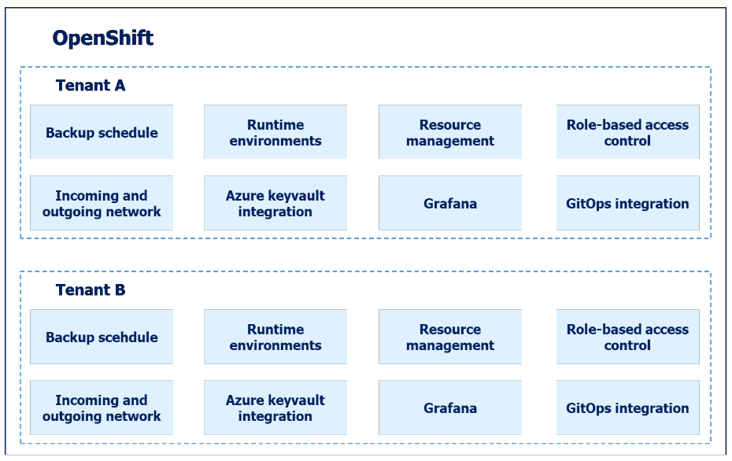
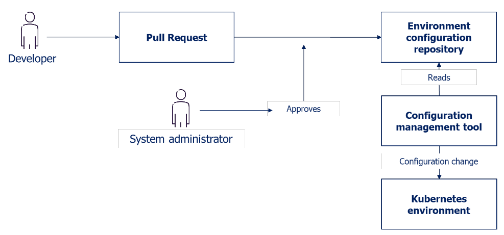

# OpenShift Tenants

## Introduction to Tenants on OpenShift
To facilitate granular access control and efficient distribution of platform resources among different development teams, the Provider has built a tenant concept. Each tenant is a set of resources that a team can choose to use.

New resources are continuously added as needed. In the tenant concept, development teams are given access to a set of OpenShift namespaces, with a combined resource limit for memory and CPU capacity. Developers can manage these resources themselves as needed through standardized roles linked to the customer’s Azure AD/Entra ID.

The figure below illustrates how two Tenants, A and B, exist on the same OpenShift platform.

## Access control with Tenants
Managing access control in Kubernetes, especially Role-Based Access Control (RBAC), can be complex and error-prone. The Tenant concept simplifies RBAC when integrated with an external identity provider (IDP) such as Azure AD. It provides ClusterRoles bound to tenant namespaces, enabling fine-grained control over access to namespaces and their resources. Furthermore, it integrates with existing OpenShift or external groups for seamless user management. 

The figure below illustrates how Azure AD groups are synced with the Tenant's environments.

In this example, there exist four Azure AD groups per tenant. Each namespace has one read group and one write group. The write group can modify and add new resources into the namespaces, and the read group can only view the resources. 

## Managing tenant configuration

Tenants are defined in the customers git. Changes in tenant configuration are submitted through pull requests. Once a pull request is approved, the changes are immediately synced to the environment through a GitOps process. This solution for ordering and configuring tenants ensures that both the Service Provider and the customer have insight into the current tenant configuration at any given time.

## Next steps
Now that you are familiar with the Tenant concept, the next step is to start developing on OpenShift. 
If you haven't ordered a tenant from Sopra Steria, follow the user guide [OpenShift Tenant Template](OpenShift-tenant-template.md) for more information on how this should be done.
