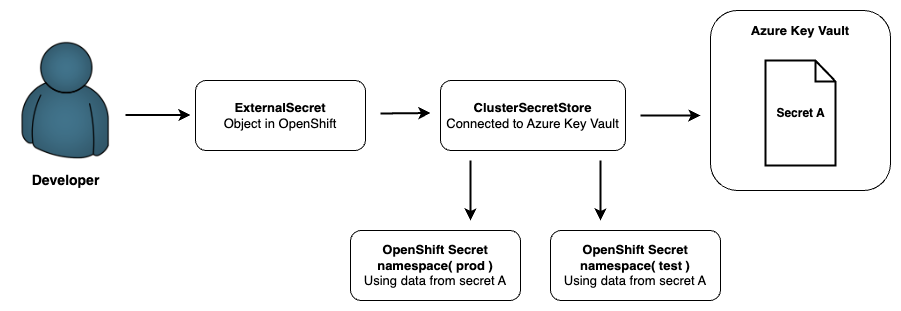

# Secret Managment with External Secrets

!!! Info
    This feature is only supported for Azure Key Vault, but contact your OpenShift administrator for additional KMS support.

    *[KMS]: Key Management System


## What is Secret Managment with External Secrets?

External Secrets in OpenShift allow you to securely store and manage sensitive information, such as API keys, passwords, and certificates, outside of your OpenShift cluster. This approach enhances security by integrating with external secret management services, ensuring that sensitive data is not exposed within the cluster configuration or codebase. By using external secrets, you can maintain better control and auditing of secret access and updates.

## Why Use Secret Managment with External Secrets?

Choosing secret managment with external secrets involves using Azure Key Vault with Cluster Secret Stores in OpenShift. This provides a seamless, secure, and scalable way to manage secrets across multiple namespaces within a tenant. By leveraging external secrets and a centralized secret store, you eliminate the need for duplicating secrets, reduce administrative overhead, and enhance security by keeping sensitive data outside individual namespaces. This approach ensures consistency, simplifies access control, and improves compliance with enterprise security policies In addition to this, it also makes secret management more efficient for developers and platform teams. Below is a diagram to illustrate how the external secrets and cluster secret store works:



## Pre-requisites
To get external secrets to work with Azure Key Vault you need have certain permissions and configure certain Azure resources:

* **Azure Permissions**: An Azure account with permissions to manage secrets within Azure KeyVault. 
   
* **OpenShift Permissions**: Access to an OpenShift account and permissions to manage resources within a specific tenant.

* **Azure Tenant ID**: Obtain this ID as it’s essential for integrating OpenShift and Azure KeyVault.

* **Service Account Access**: Set up a service account with read permissions to Azure KeyVault. 
   
* **KeyVault Credentials Secret**: Create this secret in the namespace to store Azure KeyVault access credentials. 


## Setting up Secret Store for your tenant
In OpenShift, the secret store resource defines the connection details for external secret storage platforms, such as Azure KeyVault. Azure KeyVault contains credentials, tenant ID, and the KeyVault URL, allowing OpenShift applications to fetch and use secrets from Azure securely.

The recommended way of setting up the secret store is through the OpenShift Tenant.
The tenant form is configured to derive the KeyVault name from the namespace in which it’s deployed. 
For instance, for a tenant named `tenant` with `test` and `dev` environments, secret stores will be established in each environment, connected to `tenant-test.vault.azure.net` and `tenant-dev.vault.azure.net`, respectively. This deployment approach guarantees that every environment within the tenant possesses its dedicated secret store, enhancing security and organization.

To deploy a cluster secret store within the tenant form, include the following parameters in the file (same indent as namespace and environments)

```yaml title="Setting up cluster secret store"
namespace:
  name: <tenant-name>
.
.
.
secret_management:
  external_secrets:
    enable: false # boolean - true/false
    tenant_id: <AZURE_TENANT_ID> # Tenant ID of your organizations Azure tenant
    tenant_secretstores: 
    - name: # Secret name
      keyvault_url: <https://AZURE_KEY_VAULT_URL> # Url to Azure Key Vault
      client_id: <SealedSecret_CLIENT_ID> # Sealed Secret - App Registration Credentials
      client_secret: <SealedSecret_CLIENT_SECRET> # Sealed Secret - App Registration Credentials
```

Replace `<AZURE_TENANT_ID>`, `<SealedSecret_CLIENT_ID>`, and `<SealedSecret_CLIENT_SECRET>` with your actual values. The `<SealedSecret_CLIENT_ID>` and `<SealedSecret_CLIENT_SECRET>` have to be encrypted with `kubeseal`. This can be done by following this user guide: [Encrypting secrets with Kubeseal](../../Secret Managment/encrypting-secret-with-kubeseal.md).


<!-- ## How to configure External Secrets

To configure your Azure and OpenShift environment for secret managment you need to follow these steps:

1. Azure configuration - Setup App Registration and Azure Key Vault and give the App Registartion the 'Key Vault Secret User' role
2. OpenShift Configuration - Add the App Registartion credentials and Azure Key Vault url to the OpenShift Tenant (or Team Overlay)

To configure secret managment for your OpenShift tenant using our Helm chart, include the following YAML configuration in your Helm values file:

``` yaml
...
secret_management:
  external_secrets:
    enable: false # boolean - treu/false
    tenant_id: <AZURE_TENANT_ID> # Tenant ID of your organizations Azure tenant
    tenant_secretstores: 
    - name: # Secret name
      keyvault_url: <https://AZURE_KEY_VAULT_URL> # Url to Azure Key Vault
      client_id: <CLIENT_ID> # Sealed Secret - Azure Key Vault (ServicePrinciple)
      client_secret: <CLIENT_SECRET> # Sealed Secret - Azure Key Vault (ServicePrinciple)
...
```

By setting these parameters, you can securely connect your OpenShift cluster to Azure Key Vault, managing secrets externally while providing the necessary credentials to access these secrets. This configuration ensures that sensitive information is handled securely and efficiently. -->


**Read the full configuration guides here:**

- [**Introduction to Exernal Secrets**](../../Secret%20Managment/Configure%20External%20Secrets/info-external-secrets.md)
- [**Deploying SecretStore with Azure Key Vault**](../../Secret%20Managment/Configure%20External%20Secrets/configuration-secretstore.md)
- [**Create External Secrets with Azure Key Vault**](../../Secret%20Managment/Configure%20External%20Secrets/creating-external-secrets.md)


## In-depth description of parameters

In the table below, there is a more detailed description of each variable in the `backup` feature:


| <div style="width:255px">**Variable**</div>                         | **Description**                                  | **Example**                | **Type**  | **Default Value**  |
|--------------------------------------|--------------------------------------------------|----------------------------|-----------|--------|
| `enable`                    | When using secret managment change this value to enable: True                     | false     | Boolean  | false   |
| `tenant_id`                    | The Azure Tenant ID that your organisation uses for storing its Azure Key Vaults  |d93d3d23-50e3-46db-b3ad-8c6c281b431e      | String    | "" |
| `tenant_secretstores.name`  | name of the secret | my_secret | string    | "" |
| `tenant_secretstores.url`  | The URL to the Azure Key Vault you want to use | | string    | "" |
| `tenant_secretstores.client_id`      | Username for Azure Key Vault (ServicePrinciple), which is encrypted as a sealed secret | | Kubeseal encrypted String    | "" |
| `tenant_secretstores.client_secret`  | Password for Azure Key Vault (ServicePrinciple), which is encrypted as a sealed secret | | Kubeseal encrypted String    | "" |