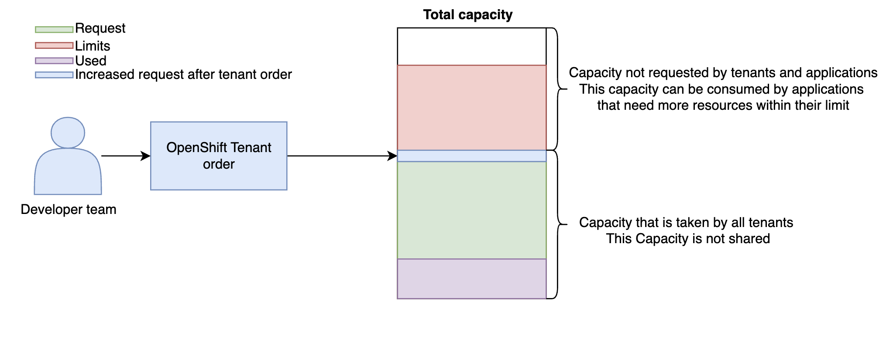

---
Author: Marcus Notø
Title: Resource Management
Version: 1.0.0
externally-exposed: true
--- 

# Resource Management with OpenShift Tenants

## Overview

Managing resources efficiently is a critical part of running a Container Platform as a Service (CPaaS) on OpenShift. Each OpenShift tenant has a limited amount of resources to use, ensuring fair access and preventing resource shortages across the platform.

To ensure redundancy, the underlying compute resources must be increased to account for potential server failures. This ensures high availability but must be balanced against cost and risk to maintain an optimal level of reliability without unnecessary expenses.

## Tenant Resource Quotas

Each OpenShift tenant has a **ClusterResourceQuota**, which defines the maximum amount of CPU and memory they can request within their namespaces. This prevents tenants from overusing resources and ensures that the cluster has enough capacity for all tenants.

To stay within their quota, tenants must set resource requests and limits for their pods and deployments. The goal is for the total resource usage of all pods in a tenant’s namespaces to stay within the requested Tenant Quota. This helps keep the cluster stable and ensures efficient resource allocation. 

The option to use request and not limits on the ClusterResourceQuota is to allow resources to have burst capacity, which can be useful in some cases. However, it is important to set limits to prevent tenants from overusing resources on the pods. 

## Scaling and Management

- Vertical Scaling: Adjusts resource limits per pod for better efficiency.

- Horizontal Scaling: Adds more worker nodes to meet increasing demand.

By setting clear quotas and managing resources effectively, OpenShift ensures fair usage, stable performance, and cost-efficient scaling.

## Scaling and Management