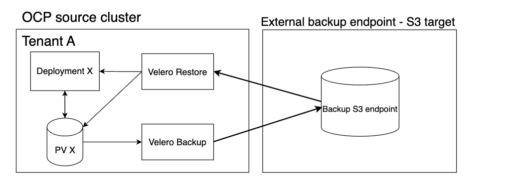
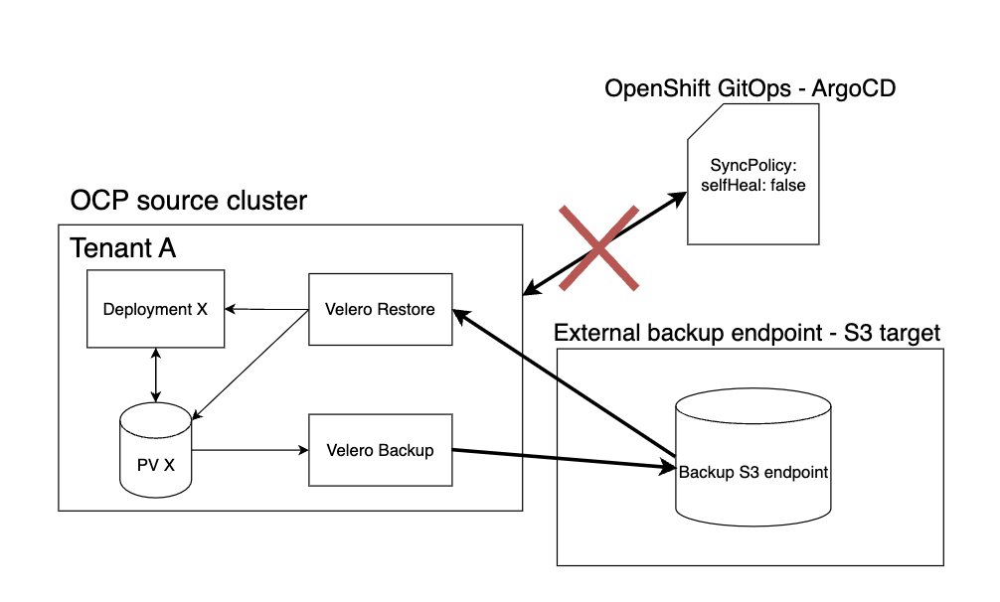

## Introduction

This document provides an overview of the backup and restore processes implemented within our OpenShift platform, specifically focusing on the utilization of Velero for backup management and MinIO as the external backup storage endpoint. 

In addition this document explains the backup setup, the types of backups we perform, how you can specify your backup scheduele, and our overall approach to keeping tenant data secure and recoverable.

### Design
 


This diagram shows the backup and restore process for Tenant A in an OpenShift cluster using Velero and MinIO as the external storage. Velero backs up the deployment and persistent volume (PV X) and sends the data to an S3-compatible storage managed by MinIO. 

The backup data is stored externally for safety. If needed, Velero can restore this data from the S3 storage back into the OpenShift cluster. This setup helps protect tenant data and makes sure it can be recovered if something goes wrong.

## Backup

We provide backup schedueles for the customer’s tenant as part of the tenant order process. Within the order, you can specify how frequently backups should be taken for a namespace, choose a name for the backup, and determine the *time to live* (`ttl`) for which the backup will be stored. Additionally, you have the flexibility to set up multiple backup schedules, allowing for daily, weekly, and monthly backups if needed.

!!! Note
    For each backup schedule, a complete backup is performed, covering all resources within the specified environment as well as all environments defined in the tenant order.

### Backup Object

The backup object executed for each schedule is defined as follows:

```yaml title="Backup object"
---
apiVersion: velero.io/v1
kind: Schedule
metadata:
  name: demo-backup
  namespace: openshift-adp
  annotations:
    argocd.argoproj.io/sync-options: Prune=false
    argocd.argoproj.io/sync-wave: "2"
    argocd.argoproj.io/compare-options: IgnoreExtraneous
    argocd.argoproj.io/sync-options: SkipDryRunOnMissingResource=true
spec:
  schedule: 0 1 * * *
  template:
    ttl: 168h0m0s
    includedNamespaces:
      - demo-namespace
    defaultVolumesToFsBackup: true
```

If you need an overview of the backups taken for a specific namespace, you can find this information in your tenant order or by contacting Sopra Steria through your customer portal.

**To learn more about how to order a backup for a namespace, please refer to this guide:**

- [Hot to configure a backup scheduele for your tenant](../../OpenShift%20Tenants/Tenant%20features/backup.md)

### Platform Resources

The table below shows who is responsible for performing backups, selecting which platform resources need to be backed up, determining the backup frequency, and deciding how long the backups should be stored. It provides a clear view of the roles and responsibilities involved in managing the backup process for platform resources.

| Resources to be included      | Backup name      | Scheduele | Time to live |
| ----------------------------- | ---------------- | --------- | ------------- |
|:material-check: Sopra Steria       |:material-check: Sopra Steria  |:material-check: Sopra Steria |:material-check: Sopra Steria |

### User Resources

The table below shows who is responsible for performing backups, selecting which user namespaces and tenant data need to be backed up, determining the backup frequency, and deciding how long the backups should be stored. It provides a clear view of the roles and responsibilities involved in managing the backup process for user resources and tenant data.

| Resources to be included      | Backup name      | Scheduele | Time to live |
| ----------------------------- | ---------------- | --------- | ------------- |
|:material-check-all: Sopra Steria & Customer[^1]       |:material-check: Customer  |:material-check: Customer |:material-check: Customer |

[^1]: 
    Sopra Steria ensures that all namespaces within a tenant are set up for backup, but it is the Customer who decides whether the tenant should be backed up or not.


## Restore

### Process

User environments can be restored on demand, but to restore data from the Persistent Volumes in these environments, we must first disable ArgoCD’s self-healing feature that automatically tries to recreate deleted objects and resources. 

This step is crucial because, for the restoration process to be successful, the environment must be cleared of all existing data. Once the environment is empty, we can proceed with restoring the data, ensuring that all resources are accurately restored. 




After the restore, ArgoCD’s self-healing can be re-enabled to maintain the desired state of the environment.

### Submitting a Restore Request

#### Instructions
Environments can be restored on demand. Please contact Sopra Steria through your customer portal and provide the following details for your restore request

- The name of the backup specified in the tenant order
- Which namespace(s) you want to back up
- Which schedule the backup is taken from


#### Disable ArgoCD Self-Healing

Disable self-healing in ArgoCD to prevent it from recreating resources from GitOps. This can be done by setting selfHeal to false in the tenant order. 

It’s important to ensure this setting is applied to the specific tenants or environments for which you have requested backups, as this will allow for a smooth and successful restoration process without interference from automated processes.

```yaml title="Tenant"
...
  argocd:
...
    syncPolicy:
      selfHeal: false
      prune: true
...
```

Before starting the restoration, ensure that the change to disable self-healing has been approved through a pull request. Submit this request to Sopra Steria for review, so they can confirm that the change is appropriate and won’t interfere with other processes. 

Once it’s approved, Sopra Steria can proceed with the restoration without iinterference from ArgoCD.
