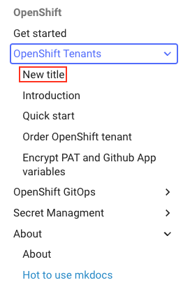
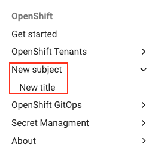

# How to write documentation for MkDocs

## Introduction
This is a step by step guide on how to write documentation for the new Mkdocs setup. 

## File structure within MkDocs
MkDocs have a few special files and a file structure that needs to be followed. There's a single configuration file named `mkdocs.yml`, and a folder named `docs/` that will contain your documentation source files.

```
.
├─ docs/
│  └─ Nav heading 1/
│     ├─ file1.md
│     └─ file2.md
│  └─ Nav heading 2/
│     ├─ file1.md
│     └─ file2.md
│  └─ index.md
└─ mkdocs.yml
```

All documentation files should be stored under the folder named `docs/` and within this file there should be a subfolder for each subject with approriate files.

The file `mkdocs.yml` is the file where all the configuration is stored and written, and it it in this file you will be creating the the navigation bar links. How this is done is explained in the secetions [Create file under existing subfolder](#create-file-under-existing-subfolder) and [Create file under new subfolder](#create-file-under-new-subfolder)

## Start writing documentation

### Clone the GitHub repository
The first thing you need to do is to clone the document repository found here: 

* [Sopra Steria - OpenShift](https://github.com/Sopra-Steria-Norge-Kubernetes/OpenShift.git)

Change directory to where you want the repository stored locally and run the git clone command of your preference.

=== "HTTPS"
    ```bash
    git clone https://github.com/Sopra-Steria-Norge-Kubernetes/OpenShift.git
    ```

=== "SSH"
    ```bash
    git clone git@github.com:Sopra-Steria-Norge-Kubernetes/OpenShift.git
    ```

### Install MkDocs and Material Theme
After cloning the repository you'll need to install MkDocs and the theme we are using on our site. Run the command below

```bash
pip install mkdocs && pip install mkdocs-material
```

MkDocs is now installed in your commandline and to verify you can run `mkdocs -V` to see the version of MkDocs you running.
You are now ready to start writing new documentation.

### Create your documentation
The firts thing you need to do before writing any documentation is to create a new branch to work on. All pushes to the `main` branch will trigger the workflow and publish a new version to the public facing documentation. Therefore always work on a branch and when finished create a new pull request to main, before merging and publishing your new documentation. All files should be written and stored in markdown-format (.md files).

```bash title="Create new branch"
git checkout -b <branch name>
```

!!! Warning
    All branch names and commit-messages will be visible to the public, so be smart when creating new branches and writing commit-messages. 

MkDocs have a built in feature that lets you see the changes you're making in live preview. To start a local instance of the site run the following command in your terminal

```bash title="Start live preview"
mkdocs serve
```

The live preview will now be available in the browser on [http://127.0.0.1:8000/](http://127.0.0.1:8000/OpenShift/)

#### Create file under existing subfolder
If you're writing documentation for a subject that already have a subfolder that suits the purpose of the documentation, create the new file under this subfolder. The next step is to create a new heading in the Navigation-bar on the site, so that the site is visible in MkDocs. 

In the configuration file `mkdocs.yml` you'll find the section `nav` containing all the navigation links visible on the site. Locate the already existing navigation heading that you have created the file under and add a new list entry as shown in the example below. 

```yaml hl_lines="4 5"
...
nav: 
  - Get started: index.md
  - OpenShift Tenants:
    - New title: OpenShift Tenants/new-file.md
    - Introduction: OpenShift Tenants/Introduction-to-openshift-tenants.md
    - Quick start: OpenShift Tenants/Orderopenshift-tenant-quick-start-guide.md
    - Order OpenShift tenant: OpenShift Tenants/Order-openshift-tenant.md
    - Encrypt PAT and Github App variables: OpenShift Tenants/Encrypt-PAT-and-GitHub-App-variables-for-argo-CD.md
  - OpenShift GitOps:
    - Introduction: OpenShift GitOps/gitops-introduction.md
    - CI/CD with Tekton Pipelines: OpenShift GitOps/continuous-integration-and-delivery-with-tekton-pipelines.md
...
```

Your new site should now be visible in the navigation bar:



#### Create file under new subfolder
If you're writing documentation for a subject that **does not** have a subfolder that suits the purpose of the documentation, then you have to create the new subfolder under `docs/`. This subfolder should have the same name as the name you want to have in the navigation bar. This will make it easier to navigate the source code and also for other to know where to place new documentation. When the folder is created, create the new file in this folder. 

In the configuration file `mkdocs.yml` you'll find the section `nav` containing all the navigation links visible on the site. In the `nav` section create a new top-level entry and add a new list entry as shown in the example below.

```yaml hl_lines="10 11"
...
nav: 
  - Get started: index.md
  - OpenShift Tenants:
    - New title: OpenShift Tenants/new-file.md
    - Introduction: OpenShift Tenants/Introduction-to-openshift-tenants.md
    - Quick start: OpenShift Tenants/Orderopenshift-tenant-quick-start-guide.md
    - Order OpenShift tenant: OpenShift Tenants/Order-openshift-tenant.md
    - Encrypt PAT and Github App variables: OpenShift Tenants/Encrypt-PAT-and-GitHub-App-variables-for-argo-CD.md
  - New subject:
    - New title: New subfolder/new-file.md
  - OpenShift GitOps:
    - Introduction: OpenShift GitOps/gitops-introduction.md
    - CI/CD with Tekton Pipelines: OpenShift GitOps/continuous-integration-and-delivery-with-tekton-pipelines.md
...
```

Your new site should now be visible udner the new subject-heading in the navigation bar:



### Publish the changes
When you're finished writing your documentation it is time to publish these changes to our customers. To do this all you have to do is to create a **pull request** from your wokring branch to main branch. This will trigger a GitHub Actions Workflow that publishes the documentation to GitHub Pages. You can look at the workflow and how this work here `.github/workflows/ci.yml`

You can find our public documentation here:

* [https://sopra-steria-norge-kubernetes.github.io/OpenShift/](https://sopra-steria-norge-kubernetes.github.io/OpenShift/)


