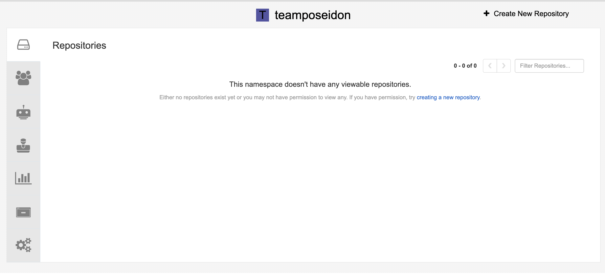

# Quay

Quay is a secure and scalable container registry for storing, building, and distributing container images. It integrates seamlessly with CI/CD pipelines and supports automated builds, vulnerability scanning, and fine-grained access control.

This guide walks you through the essentials of using Quay.

---

## Quay Structure

At a high level, Quay is organized into:

- **Repositories** – Where container images are stored.
    
- **Organizations** – Groups of repositories for easier management.
    
- **Teams** – Collections of users with assigned permissions.
    

---

## Getting Started

### 1. Log in to Quay

- Navigate to your Quay instance (e.g., `https://quay.io` or your company’s private Quay).
    
- Log in with your credentials (username/password, LDAP, or SSO).
    

After login, you’ll land on the **dashboard**.

### 2. Explore the Web UI

![[../../Screenshot 2025-09-19 at 13.47.28.png]]

The Quay web interface gives you access to:

- **Repositories** – Your own and shared ones.
    
- **Organizations** – Repository groups.
    
- **User Settings** – Manage tokens, linked accounts, and notifications.
    
- **Security** – Vulnerability reports for your images.
    

---

## Creating Organizations & Teams

### 1. Create an Organization

1. In the top navigation, click **New Organizations**.
    
2. Enter a name and description.
    
4. Click **Create**.
    

Organizations help you group repositories (e.g., per project, department, or team).

## Best Practices

- Use **organizations** as individual teams or projects. 

### 2. Create Teams

1. Inside your organization, go to **Teams**.
    
2. Click **Create Team**. 
    
3. Name your team (e.g., `devs`, `ci-cd`, `admins`).

4. When assigning users this can be done in 2 ways. ![[../../Pasted image 20250922103317.png]]
	You could add them manually by assigning team members by email or username. Like you see in the lower right corner. The only prerequsite is that the user you want to add, has to have logged in once, so the user is created. 
    
4. Set their role:
    
    - **Admin** – Full control (settings, repositories, teams).
        
    - **Write** – Can push images.
        
    - **Read** – Can only pull images.
        

## Best Practices

- Apply **least-privilege access** with teams (e.g., give CI/CD pipelines write access, developers read access).
---

## Working with Repositories

### 1. Create a Repository

1. From the organization, create **New Repository**

    
2. Enter a name and set visibility:
    
    - **Public** – Anyone can pull images.
        
    - **Private** – Restricted to authorized users/teams.
        
3. Click **Create Repository**.
## Best Practice
**Keep Repositories Private** – Unless images are meant for public use, prefer private repositories for security

## Conclusion
Whether you’re a developer pushing images, a DevOps engineer automating builds, or a security team reviewing vulnerabilities, Quay offers the tools you need to maintain a robust container ecosystem.