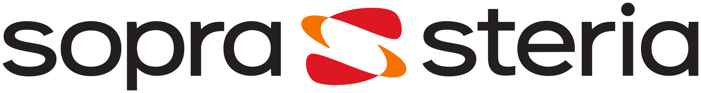

# OpenShift by Sopra Steria

## Getting Started with OpenShift -  Container Platform as a Service

Welcome to the user guide for getting started with the Container as a Service (CaaS) provided by Sopra Steria, delivered with OpenShift. OpenShift simplifies application development, deployment, and management by leveraging the robustness and resiliency of the underlying VMware infrastructure. Built on top of Kubernetes, OpenShift offers a wide range of "add-ons" that enhance containerization, providing a rich set of tools and features. In this guide, we will walk you through the steps to kickstart your journey with OpenShift and unleash the full potential of containerized applications.

 
 
 
 

<figure markdown="span">
  { width="300" }
</figure>

<figure markdown="span">
  { width="450" }
</figure>

<!-- Logos in cards side by side -->

<!-- 

{ .card }

{ .card }

 -->